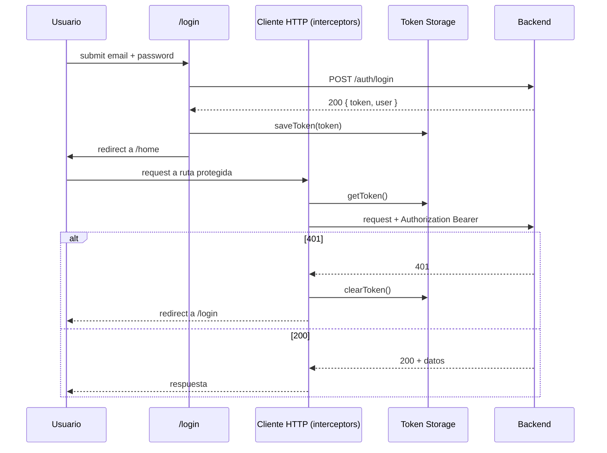

# TicketFlow — Documento de Requerimientos del Producto

---

## 1. Descripción General del Producto

TicketFlow es una plataforma web para compra de tickets, creada como el proyecto principal de la edición frontend de la serie de cursos *Claude Code: Desarrollo de Software Dirigido por Agentes IA*.

La aplicación permite que usuarios autenticados exploren eventos, seleccionen asientos desde un mapa dinámico del venue, simulen un flujo de pago y administren sus reservaciones — todo dentro de una interfaz limpia, responsive y visualmente consistente.

El backend es una mock REST API completamente funcional (Express + SQLite), distribuida como una imagen de Docker. El frontend la consume exactamente como consumiría un servicio de producción — durante este curso, los estudiantes nunca modifican el backend.

---

## 2. Identidad de Marca

### 2.1 Nombre
**TicketFlow** — simple, memorable y agnóstico al dominio. El nombre refleja la experiencia principal: un flujo suave e ininterrumpido desde el descubrimiento de eventos hasta la confirmación del ticket.

### 2.2 Tema Visual
TicketFlow utiliza un **design system inspirado en Nord** — la misma paleta amada por desarrolladores en sus IDEs, adaptada para una web UI profesional.

#### Paleta de Colores

| Token | Hex | Uso |
|---|---|---|
| `--color-bg-dark` | `#2E3440` | Fondo principal, sidebar |
| `--color-bg-medium` | `#3B4252` | Cards, paneles, modales |
| `--color-bg-light` | `#434C5E` | Estados hover, divisores |
| `--color-bg-lighter` | `#4C566A` | Bordes, inputs |
| `--color-snow-1` | `#D8DEE9` | Texto de cuerpo |
| `--color-snow-2` | `#E5E9F0` | Headings |
| `--color-snow-3` | `#ECEFF4` | Texto blanco sobre fondos oscuros |
| `--color-frost-1` | `#8FBCBB` | Acento secundario |
| `--color-frost-2` | `#88C0D0` | Links, estados informativos |
| `--color-frost-3` | `#81A1C1` | Botones primarios |
| `--color-frost-4` | `#5E81AC` | Hover de botón primario |
| `--color-aurora-orange` | `#D08770` | CTAs, highlights, selección de asiento |
| `--color-aurora-red` | `#BF616A` | Estados de error, estatus cancelado |
| `--color-aurora-yellow` | `#EBCB8B` | Estados de advertencia, estatus pendiente |
| `--color-aurora-green` | `#A3BE8C` | Estados de éxito, estatus confirmado, asientos disponibles |
| `--color-aurora-purple` | `#B48EAD` | Acentos decorativos |

#### Tipografía
- **Font family:** Inter (Google Fonts) — universal, altamente legible y profesional
- **Headings:** Inter SemiBold (600)
- **Body:** Inter Regular (400)
- **Code/IDs:** JetBrains Mono — para booking IDs y valores técnicos

#### Principios de Diseño
- Fondos oscuros con texto claro — consistente con el tema Nord
- Espaciado generoso — el contenido respira
- Bordes sutiles — `1px solid var(--color-bg-lighter)`
- Esquinas redondeadas — `border-radius: 8px` para cards, `4px` para inputs y botones
- Sin drop shadows — diseño plano con diferenciación por bordes

### 2.3 Logo
El logo se proporcionará por separado como un asset PNG. El wordmark utiliza Inter SemiBold con el color frost-3 (`#81A1C1`) para "Ticket" y aurora-orange (`#D08770`) para "Flow".

---

## 3. Contexto Técnico

### 3.1 Backend
El backend es una REST API completamente mockeada, distribuida como una imagen pública de Docker.

```bash
docker pull debuggerbyte/ticketflow-api:latest
docker run -p 3000:3000 debuggerbyte/ticketflow-api:latest
```

- Base URL: `http://localhost:3000`
- Authentication: Bearer Token (opaco, en memoria)
- Database: SQLite (se reinicia en cada restart del contenedor)
- API Documentation: `http://localhost:3000/api-docs`

### 3.2 Endpoints Implementados

| Method | Endpoint | Auth | Descripción |
|---|---|---|---|
| `POST` | `/auth/login` | Public | Autenticar usuario y recibir token |
| `POST` | `/auth/logout` | Protected | Revocar token |
| `GET` | `/users/me` | Protected | Obtener el perfil del usuario autenticado |
| `GET` | `/events` | Protected | Listar todos los eventos disponibles |
| `GET` | `/events/:id/seats` | Protected | Obtener layout del venue y disponibilidad de asientos |
| `POST` | `/payment/process` | Protected | Simular pago (delay de 2–5s, 90% de aprobación) |
| `POST` | `/bookings` | Protected | Crear una reservación después de un pago exitoso |
| `GET` | `/bookings` | Protected | Listar reservaciones del usuario con filtros y paginación |
| `PATCH` | `/bookings/:id/cancel` | Protected | Cancelar una reservación |

> Esta tabla describe **qué existe y para qué sirve**. No describe el shape exacto de cada payload — ver 3.2.1.

### 3.2.1 Contrato de API — Fuente de Verdad

> **Esta sección existe para eliminar una causa concreta de alucinaciones detectada en el curso:** al generar Specs de arquitectura de forma independiente (uno por archivo, en sesiones separadas), el modelo no tenía dónde consultar el shape exacto de un request o response — y lo inventaba por inferencia razonable (ej. asumir `response.data.token` en el login sin que ningún documento lo confirmara).

**Fuente única — Postman collection**

- El contrato de datos **exacto** de cada uno de los endpoints del backend — nombres de campos, request bodies, códigos de estado, códigos de error de negocio — vive **únicamente** en la Postman collection:

  ```
  docs/ticketflow-api.postman_collection.json
  ```

- Este archivo se entrega **junto con este PRD** como parte del contexto cargado en el proyecto Claude que genera los Specs de arquitectura — no es un archivo externo que haya que ir a buscar.
- El backend también publica un OpenAPI spec (`http://localhost:3000/api-docs`), pero **deliberadamente no se usa como fuente para este curso**: consultarlo implicaría hacer una llamada HTTP en tiempo de generación de cada Spec, lo cual es más lento y consume tokens innecesarios en un proyecto que es puramente frontend. El Postman collection, al vivir como archivo estático en la raíz del proyecto, cubre la misma necesidad sin esa dependencia.
- Este PRD (`Context.md`) describe **comportamiento, intención de producto y reglas de negocio**. El Postman collection describe **el contrato de datos**. Son complementarios, no intercambiables.
- **Regla de prioridad ante conflicto o ambigüedad:** el Postman collection tiene siempre prioridad sobre cualquier inferencia hecha a partir de este documento.
- **Regla para quien genere un Spec o un ticket a partir de este PRD:** si necesitas describir un payload, una respuesta, un campo o un código de error, y ese detalle no está explícito en el Postman collection, **no lo inventes** — señálalo como pendiente de confirmar en vez de presentarlo como un hecho documentado.
- El Postman collection debe consultarse directamente (no citarse de memoria) antes de escribir cualquier Spec que involucre llamadas HTTP — en particular `SpecHttp.md`, `SpecAuth.md`, `SpecPurchase.md`, `SpecSeatMap.md` y `SpecBookings.md`.

**Códigos de error confirmados**

El Postman collection valida, contra el backend real, los siguientes códigos devueltos por el backend. Se dividen en dos grupos porque tienen orígenes distintos y merecen tratamiento distinto en el interceptor y en los componentes:

*Errores de negocio* — específicos del dominio de TicketFlow, casi siempre requieren un mensaje distinto al genérico:

| Código | Status HTTP | Contexto |
|---|---|---|
| `INVALID_CREDENTIALS` | 401 | Login con email o password incorrectos |
| `EVENT_NOT_FOUND` | 404 | Evento inexistente al pedir sus asientos |
| `SEAT_UNAVAILABLE` | 409 | Intento de reservar un asiento ya ocupado |
| `BOOKING_NOT_FOUND` | 404 | Cancelación de un booking inexistente |
| `INVALID_TRANSITION` | 409 | Cancelación de un booking ya cancelado |
| `PAYMENT_DECLINED` | 402 | Pago rechazado por la simulación (10% de los casos) |

*Errores de validación e infraestructura* — genéricos, no específicos del dominio, normalmente cubiertos por el manejo genérico de status HTTP (7.1):

| Código | Status HTTP | Contexto |
|---|---|---|
| `VALIDATION_ERROR` | 400 | Body de request con campos inválidos o faltantes |
| `UNAUTHORIZED` | 401 | Request protegido sin token |
| `USER_NOT_FOUND` | 404 | Usuario inexistente (ej. `GET /users/me` con token inválido) |
| `NOT_FOUND` | 404 | Recurso genérico no encontrado, fuera de los casos específicos de arriba |
| `INTERNAL_SERVER_ERROR` | 500 | Error no controlado del backend |

> Estos códigos son distintos del manejo genérico por status HTTP descrito en la sección 7.1. El interceptor global de 7.1 sigue aplicando para el status HTTP; el código específico (`error` en el body) debe manejarse en el componente correspondiente cuando aporte un mensaje más preciso que el genérico. **Ningún Spec debe inventar códigos de error distintos a los definidos por el backend** — si un caso de error no está en ninguna de estas dos tablas, se señala como pendiente de confirmar, no se asume.

**Patrón de idempotencia del pago**

El Postman collection confirma que `POST /payment/process` recibe **únicamente** el campo `method`, cuyo valor permitido es `card` o `paypal`. No existe un campo `simulated` ni un header de idempotencia. El mecanismo real de idempotencia de este proyecto es distinto: el `transactionId` que devuelve `POST /payment/process` se reenvía como parte del body de `POST /bookings` (`payment.transactionId`). Esa reutilización del `transactionId` — no un header nuevo — es la implementación del concepto "Idempotency Key" en este proyecto: identifica de forma única el pago ya aprobado que autoriza la creación del booking en el Paso 4 del Purchase Flow (sección 5.4). Cualquier Spec que mencione Idempotency Key debe describir este mecanismo, no inventar un header adicional ni un campo `simulated`.

### 3.3 Frontend Stack
El curso es **framework-agnostic**. Los estudiantes eligen su framework preferido:
- React
- Angular
- Vue

La arquitectura, los componentes y los patrones enseñados son idénticos en los tres. Solo cambia la sintaxis — Claude Code se encarga de las diferencias de implementación.

### 3.4 Responsive Breakpoints
| Breakpoint | Width | Target |
|---|---|---|
| Mobile | `< 768px` | Smartphones |
| Tablet | `768px – 1024px` | iPads, laptops pequeñas |
| Desktop | `> 1024px` | Web estándar |

---

## 4. Seed Data

El backend incluye seed data fija para demos y pruebas determinísticas.

### Usuarios
| ID | Nombre | Email | Password |
|---|---|---|---|
| usr-001 | Sofía Hernández | sofia.hernandez@ticketflow.com | ticket123 |
| usr-002 | Mateo García | mateo.garcia@ticketflow.com | ticket123 |
| usr-003 | Valeria López | valeria.lopez@ticketflow.com | ticket123 |
| usr-004 | Diego Martínez | diego.martinez@ticketflow.com | ticket123 |

### Venues
| ID | Nombre | Tipo |
|---|---|---|
| ven-001 | Nova Arena | arena |
| ven-002 | Luna Center | halfmoon |
| ven-003 | Teatro Ámbar | flat |

### Eventos
20 artistas ficticios distribuidos en los 3 venues. Los nombres de los artistas son parodias de artistas reales — legalmente seguros y pedagógicamente divertidos.

| ID | Artista | Venue | Ubicación |
|---|---|---|---|
| evt-001 | Bad Liebre | Nova Arena | Ciudad de México |
| evt-002 | Karolina G | Nova Arena | Ciudad de México |
| evt-003 | Lentejuela | Nova Arena | Ciudad de México |
| evt-004 | Rosa y Lía | Nova Arena | Ciudad de México |
| evt-005 | Shut N' Roses | Nova Arena | Ciudad de México |
| evt-006 | Draft Funk | Nova Arena | Ciudad de México |
| evt-007 | Peso Mosca | Nova Arena | Ciudad de México |
| evt-008 | Doble Lipa | Luna Center | Madrid |
| evt-009 | Taylor Flux | Luna Center | Madrid |
| evt-010 | The Bugs | Luna Center | Madrid |
| evt-011 | Coldpause | Luna Center | Madrid |
| evt-012 | Queens of León | Luna Center | Madrid |
| evt-013 | Princess | Luna Center | Madrid |
| evt-014 | The Weekly | Luna Center | Madrid |
| evt-015 | Desert Monkeys | Teatro Ámbar | Ciudad de México |
| evt-016 | Gentleman Gaga | Teatro Ámbar | Ciudad de México |
| evt-017 | Liquid Park | Teatro Ámbar | Ciudad de México |
| evt-018 | Bruno Jupiter | Teatro Ámbar | Ciudad de México |
| evt-019 | Fuzz Fighters | Teatro Ámbar | Ciudad de México |
| evt-020 | Green Hot Chili Peppers | Teatro Ámbar | Ciudad de México |

---

## 5. Pantallas y Funcionalidad

### 5.1 Mapa de Pantallas

```
/login
/home
  ├── /buy          (flujo de compra — 5 pasos)
  └── /bookings     (mis reservaciones)
```

---

### 5.2 Pantalla 1 — Login (`/login`)

**Propósito:** Autenticar al usuario y redirigirlo a Home.

**Elementos:**
- Logo de TicketFlow centrado en la parte superior
- Input de email
- Input de password con toggle para mostrar/ocultar
- Botón primario: **Sign in**
- Divisor
- Botón secundario: **Create account** — deshabilitado, badge `// TODO`
- Link: **Forgot your password?** — deshabilitado, badge `// TODO`

**Comportamiento:**
- Al hacer submit → `POST /auth/login`
- En éxito → guardar token en memoria/localStorage → redirigir a `/home`
- En error → mostrar mensaje inline: *"Email o password inválidos"*
- Los campos son obligatorios — mostrar error de validación si están vacíos al hacer submit

**Qué enseña:**
- Manejo y validación de formularios
- Configuración del HTTP client
- Estrategia de almacenamiento del token
- Redirección después de la autenticación

---

### 5.3 Pantalla 2 — Home / Menú (`/home`)

**Propósito:** Hub principal de navegación después del login.

**Layout:** Sidebar fijo (desktop) / navegación inferior (mobile)

**Elementos del sidebar:**
- Logo + wordmark de TicketFlow
- Elementos de navegación:
  - 🎫 **Buy tickets** → `/buy` (activo)
  - 📋 **My tickets** → `/bookings`
  - 🔍 **Explore** → deshabilitado, badge *"Soon"* — `// TODO`
  - ❤️ **Favorites** → deshabilitado, badge *"Soon"* — `// TODO`
- Sección inferior:
  - Avatar del usuario + nombre + email (desde token/profile)
  - Botón **Logout**

**Comportamiento:**
- Al cargar → `GET /users/me` para mostrar la información del usuario en el sidebar
- Logout → `POST /auth/logout` → limpiar token → redirigir a `/login`
- El nav item activo se resalta con un borde izquierdo en aurora-orange

**Qué enseña:**
- Route guards (redirigir a login si no hay token)
- Componentes de layout compartido
- UI condicional basada en el usuario autenticado
- HTTP interceptors (adjuntar token a cada request)
- Manejo global de 401 (redirigir a login cuando expira el token)

---

### 5.4 Pantalla 3 — Purchase Flow (`/buy`)

La experiencia principal. Un stepper de 5 pasos con transiciones animadas entre pasos.

**Stepper header:** siempre visible en la parte superior, mostrando el paso actual y el estado de completado.

---

#### Paso 1 — Seleccionar Evento

**Propósito:** Explorar y seleccionar un evento al cual asistir.

**Comportamiento:**
- Al montar → `GET /events`
- El endpoint `GET /events` **no** devuelve `venueType`. El tipo de venue (`arena`, `halfmoon`, `flat`) se obtiene únicamente mediante `GET /events/:id/seats`, cuando el usuario entra al Paso 3 — no lo infieras ni lo muestres en el listado de eventos.
- Renderizar un grid responsive de event cards
- Cada card muestra: imagen del evento, nombre del artista, fecha, hora, ubicación, precio base
- Click en una card → la card obtiene estado seleccionado (borde naranja)
- Botón **Next** deshabilitado hasta seleccionar un evento

**Anatomía de la event card:**
- Imagen (PNG 400x400 desde GitHub CDN)
- Nombre del artista (heading)
- Fecha y hora
- Ubicación
- Etiqueta de precio: *"Desde $XX.XX USD"*

**Qué enseña:**
- Data fetching al montar un componente
- Grid layout con columnas responsive
- Manejo de estado seleccionado
- Activación condicional de botones

---

#### Paso 2 — Tus Datos

**Propósito:** Confirmar la información de contacto para la entrega de tickets.

**Comportamiento:**
- Al montar → `GET /users/me` (o usar datos cacheados desde la respuesta de login)
- Prellenar el formulario con los datos del usuario
- El usuario puede editar email y teléfono
- Todos los campos son obligatorios

**Campos del formulario:**
- First name (prellenado, editable)
- Last name (prellenado, editable)
- Email (prellenado, editable) — *"Los tickets se enviarán aquí"*
- Phone (prellenado, editable)

**Qué enseña:**
- Prellenado de formularios desde datos de API
- Controlled inputs
- Persistencia de estado entre pasos del stepper

---

#### Paso 3 — Seleccionar tu Asiento

**Propósito:** Mapa interactivo del venue — seleccionar un asiento.

**Comportamiento:**
- Al montar → `GET /events/:id/seats`
- La respuesta incluye `venueType` → determina qué componente de layout renderizar
- La respuesta incluye `zones` → color y precio por zona
- La respuesta incluye `seats` → matriz completa de asientos con estatus

**Tres layouts de venue:**

**Arena** (`venueType: "arena"`)
- Asientos organizados en círculos concéntricos alrededor de un escenario central
- 4 anillos × 12 asientos = 48 asientos
- Renderizado con SVG
- Label del escenario al centro

**Halfmoon** (`venueType: "halfmoon"`)
- Filas con indentación progresiva — estilo teatro
- 6 filas × 10 asientos = 60 asientos
- Escenario en la parte superior central

**Flat** (`venueType: "flat"`)
- Grid rectangular simple
- 8 filas × 10 asientos = 80 asientos
- Escenario arriba

**Estados del asiento:**
| Estado | Color | Interacción |
|---|---|---|
| Available | `--color-aurora-green` | Clickable |
| Occupied | `--color-bg-lighter` | Disabled |
| Selected | `--color-aurora-orange` | Clickable (deselecciona) |

**Leyenda de zonas:** se muestra debajo del mapa — nombre de zona, punto de color, precio.

**Popover del asiento:** al hacer hover/click sobre un asiento disponible — muestra fila, columna, zona y precio.

Botón **Next** deshabilitado hasta seleccionar un asiento.

**Qué enseña:**
- Renderizado condicional de componentes según datos de API
- Renderizado SVG desde cero (layout arena)
- Manejo de estado complejo (selección de asiento)
- Pricing dinámico desde datos de zona

---

#### Paso 4 — Payment

**Propósito:** Seleccionar método de pago y completar la compra.

**Layout:** Dos columnas en desktop (formulario de pago + resumen de orden), una sola columna en mobile.

**Métodos de pago:**
- 💳 **Credit card** — muestra formulario de tarjeta
- 🅿️ **PayPal** — muestra botón de redirección simulada

**Campos del formulario de tarjeta:**
- Card number — autoformateado como `XXXX XXXX XXXX XXXX`
- Expiration date — formato `MM/YY`
- CVV — 3 dígitos
- Cardholder name

**Resumen de orden (siempre visible):**
- Nombre del evento
- Fecha y hora
- Asiento — fila, columna, zona
- Precio base
- Service fee: $8.00
- **Total**

**Comportamiento del botón de pago:**
1. Validar campos del formulario
2. Deshabilitar botón + mostrar spinner
3. `POST /payment/process` — esperar 2–5 segundos
4. **En éxito (90%):** `POST /bookings` → navegar al Paso 5
5. **En fallo (10%):** mostrar mensaje de error *"Tu pago fue rechazado. Intenta nuevamente."* + volver a habilitar el botón

**Qué enseña:**
- Loading states y feedback de UI durante operaciones async
- Renderizado condicional de formularios (tarjeta vs PayPal)
- Formateo de inputs (máscara de número de tarjeta)
- Manejo de errores y flujo de reintento
- API calls encadenadas (payment → booking)
- Patrones de Optimistic UI

---

#### Paso 5 — Confirmation

**Propósito:** Confirmar la reservación y celebrar la compra.

**Elementos:**
- ✅ Ícono animado de éxito
- Heading: *"¡Reservación confirmada!"*
- Booking ID (estilizado como code): `TF-XXXXXX`
- Mensaje: *"Tus tickets se enviarán a [email]"*
- Resumen del evento: nombre, fecha, asiento, total
- Dos botones:
  - **View my tickets** → navegar a `/bookings`
  - **Buy another** → reiniciar stepper al Paso 1

**Comportamiento:**
- Los datos vienen de la respuesta de `POST /bookings` — no se necesita un fetch adicional

**Qué enseña:**
- Diseño de estado de éxito
- Reinicio de estado
- Navegación después de completar un flujo

---

### 5.5 Pantalla 4 — My Bookings (`/bookings`)

**Propósito:** Ver y administrar todas las reservaciones del usuario.

**Layout:** Tabla de ancho completo con barra de filtros arriba.

**Barra de filtros:**
| Filtro | Tipo | API param |
|---|---|---|
| Búsqueda por evento | Text input | `eventName` |
| Status | Select dropdown | `status` |
| Date from | Date picker | `dateFrom` |
| Date to | Date picker | `dateTo` |

**Comportamiento:**
- Los filtros se serializan como URL query params — la URL es la source of truth
- Al cambiar filtros → `GET /bookings?status=x&eventName=y&page=1&limit=10`
- Los filtros se aplican en tiempo real (con debounce) o mediante botón submit — TBD según framework

**Columnas de la tabla:**
| Columna | Fuente |
|---|---|
| # | `booking.id` |
| Evento | `booking.eventName` |
| Fecha | `booking.eventDate` + `booking.eventTime` |
| Asiento | `seat.row` + `seat.col` + `zone` |
| Total | `booking.total` + `booking.currency` |
| Status | `booking.status` (badge) |
| Acciones | Botón Cancelar (condicional) |

**Status badges:**
| Status | Color |
|---|---|
| `confirmed` | `--color-aurora-green` |
| `pending` | `--color-aurora-yellow` |
| `cancelled` | `--color-aurora-red` |

**Comportamiento de cancelación:**
- El botón solo es visible/habilitado si el status es `confirmed` o `pending`
- Click → modal de confirmación: *"¿Seguro que quieres cancelar esta reservación?"*
- Al confirmar → `PATCH /bookings/:id/cancel`
- En éxito → actualizar el status de la fila en la tabla (optimistic update)

**Paginación:**
- Controlada por query params `page` y `limit`
- Barra de paginación inferior: Previous, números de página, Next
- Default: 10 registros por página

**Estado vacío:**
- Ilustración + mensaje: *"Aún no tienes reservaciones"*
- Botón CTA: **Buy your first ticket** → navegar a `/buy`

**Qué enseña:**
- Filtros dinámicos serializados en URL (el Criteria Builder del frontend)
- Paginación server-side
- Visualización de state machine (status badges)
- Optimistic updates al cancelar
- UI condicional según el estado de los datos (vacío vs con datos)
- Patrones de diseño de tablas

---

## 6. State Machines

### 6.1 Estado de Autenticación
```
[unauthenticated]
      ↓ POST /auth/login (success)
[authenticated]
      ↓ POST /auth/logout
[unauthenticated]
```

### 6.2 Estado del Purchase Flow
```
[step-1: select event]
      ↓ event selected
[step-2: your details]
      ↓ details confirmed
[step-3: select seat]
      ↓ seat selected
[step-4: payment]
      ↓ payment approved (90%)
[step-5: confirmation]
      ↓ payment declined (10%)
[step-4: payment — error state]
```
Nota: Los pasos pueden navegarse hacia atrás (1→2→3→4), pero no desde el paso 5.

### 6.3 Booking State Machine
```
[confirmed] ──→ [cancelled]  (terminal — non-reversible)
[pending]   ──→ [cancelled]  (terminal — non-reversible)
[cancelled] ──→ ✗ (cannot transition — returns 409)
```

---

## 7. Arquitectura del HTTP Client

### 7.1 Interceptors (aplica a todos los frameworks)

**Request interceptor:**
- Adjuntar `Authorization: Bearer <token>` a cada request protegido
- Leer token desde storage (localStorage o memoria)

**Response interceptor:**
- En `401` → limpiar token → redirigir a `/login`
- **Excepción:** `POST /auth/login` está excluido de esta regla. Es el único endpoint público del proyecto (3.2) — su `401` significa credenciales inválidas (`INVALID_CREDENTIALS`, ver 3.2.1), no expiración de sesión. Para esa llamada específica, el `401` debe propagarse tal cual al componente de login, sin `clearToken()` ni redirección.
- En `403` → mostrar toast: *"No tienes permiso para realizar esta acción"*
- En `500` → mostrar toast: *"Ocurrió un error inesperado. Intenta nuevamente."*
- En `402` (payment declined) → se maneja localmente en el componente de payment, no globalmente

### 7.2 Configuración base
```
baseURL: http://localhost:3000
timeout: 10000ms
headers:
  Content-Type: application/json
```

> Los payloads exactos de cada request/response mencionados en esta sección deben confirmarse contra `docs/ticketflow-api.postman_collection.json` (ver 3.2.1) — esta sección describe la arquitectura del cliente HTTP, no el contrato de datos.

### 7.3 Regla de propiedad: Cliente HTTP vs. Autenticación (previene dependencias circulares)

> **Esta regla existe para resolver un problema real y ya observado:** al diseñarse la arquitectura del cliente HTTP y la del flujo de autenticación por separado, cada una terminó necesitando a la otra para quedar completa — el cliente HTTP necesitaba saber cómo se guarda el token para poder leerlo en su interceptor, y la autenticación necesitaba saber cómo funciona el interceptor para poder integrarse con él. El resultado fue un ciclo A→B→A donde ninguno de los dos documentos era autosuficiente. Esta sección fija una dirección única para que eso no vuelva a pasar.

**Regla (unidireccional, sin excepciones):**

- **Todo lo que forme parte del cliente HTTP en sí mismo** se define aquí, en la sección 7, de forma completa y de una sola vez:
  - Configuración base (7.2)
  - Interceptor de request — incluida la lectura del token desde storage
  - Interceptor de response — incluido el manejo de `401` (limpiar token + redirigir)
  - El módulo de almacenamiento del token (dónde y cómo se guarda, se lee y se borra), porque los interceptores anteriores dependen de él para funcionar
- Esto aplica **aunque el contenido esté temáticamente relacionado con autenticación.** El criterio de dónde vive una pieza no es "de qué tema habla", es "qué necesita el cliente HTTP para funcionar de forma completa por sí solo, sin depender de nada que se defina después".
- **El flujo de autenticación** (pantalla de login, botón de logout, validación de campos, mensajes de error de negocio — sección 5.2 y 5.3) se construye **usando** el cliente HTTP y su módulo de storage ya completos. **Consume, no redefine:** llama a las funciones de guardar/leer/borrar token que ya existen, y llama a `POST /auth/login` / `POST /auth/logout` a través del cliente HTTP ya configurado.
- **Dirección de la dependencia — una sola vía:** Autenticación → depende de → Cliente HTTP. Nunca al revés. Ningún documento sobre el cliente HTTP debe citar, esperar o depender de algo definido en el flujo de autenticación para estar completo.
- En términos prácticos para quien genere Specs o tickets a partir de este documento: si estás documentando o implementando el cliente HTTP y llegas a un punto que "suena a autenticación" (ej. qué pasa con el token en un 401), no lo dejes pendiente para más adelante — resuélvelo aquí mismo. La autenticación nunca debe tener que volver a tocar o completar el cliente HTTP.
- Los nombres exactos del módulo de Token Storage y el contrato de los interceptors están fijados en la sección 8.2 y 8.3 — no son responsabilidad de ningún Spec individual definirlos.

---

## 8. Arquitectura de Referencia (Abstracta, Agnóstica de Framework)

> **Esta sección es el plano final, no un punto de partida.** Un Spec no diseña lo que está aquí — lo traduce a la sintaxis de React, Angular o Vue. Si un Spec necesita un nombre, un campo o una función que no está en esta sección, no lo inventa: lo señala como pendiente. Esta sección existe para que los 8 prompts de generación de Specs puedan ejecutarse **de forma independiente, en cualquier chat, en cualquier orden**, y aun así producir resultados consistentes entre sí — porque todos parten del mismo plano nombrado, no de lo que otro Spec haya decidido antes.

### 8.1 Estructura de carpetas de referencia

```
src/
  http/         → cliente HTTP + interceptors (ver 8.3)
  services/     → un servicio por recurso: auth, events, seats, payment, bookings
  state/        → slices de estado (ver 8.4)
  features/     → login, home, purchase (stepper de 5 pasos), bookings
  components/   → UI compartida (cards, tablas, badges, layouts)
```

### 8.2 Módulo de Token Storage — Interfaz de referencia

| Función | Parámetros | Retorna | Se usa en |
|---|---|---|---|
| `saveToken` | `token: string` | `void` | Login, tras `200` de `POST /auth/login` |
| `getToken` | — | `string \| null` | Request interceptor (8.3) |
| `clearToken` | — | `void` | Logout, y response interceptor en `401` |
| `hasToken` | — | `boolean` | Route Guards (8.5) |

Estos son los nombres de referencia. Cualquier Spec que toque login, logout, el cliente HTTP o route guards usa exactamente estas cuatro funciones — no redefine el módulo ni le cambia el nombre.

### 8.3 Interceptors — Contrato

- **Request interceptor:** llama a `getToken()`. Si existe, agrega `Authorization: Bearer <token>` al request.
- **Response interceptor:** en `401`, llama a `clearToken()` y dispara la redirección a `/login` (el mecanismo concreto de redirección — router de React/Angular/Vue — lo define el Spec de HTTP al traducir esto a framework).
- **Excepción nombrada y cerrada:** `POST /auth/login` no pasa por esta lógica de `401`. Su `401` es el error de negocio `INVALID_CREDENTIALS` (3.2.1), no expiración de sesión — se propaga sin `clearToken()` ni redirección, para que el componente de login lo muestre inline. No hay otros endpoints públicos en el proyecto (3.2), así que esta es la única excepción y no requiere una regla genérica de "endpoints públicos".
- El comportamiento completo por status code (`403`, `500`, `402`) ya está descrito en 7.1 — esta sección solo fija los nombres de función que el interceptor usa internamente.

### 8.4 Slices de Estado — Referencia

| Slice | Campos principales | Lo consume |
|---|---|---|
| `auth` | `user`, `isAuthenticated` | Home (sidebar), Route Guards |
| `purchase` | `selectedEvent`, `contactDetails`, `selectedSeat`, `paymentResult` | Purchase Flow — los 5 pasos |
| `seatMap` | `zones`, `seats`, `selectedSeatId` | Paso 3 — selección de asiento |
| `bookings` | `filters`, `page`, `limit`, `items` | My Bookings |

Estos cuatro slices, con estos nombres y estos campos, son la referencia. Cualquier Spec que maneje estado usa esta forma — no inventa una estructura propia ni le cambia el nombre a un slice.

### 8.5 Tabla de Rutas y Guards

| Ruta | Requiere sesión | Si no autenticado |
|---|---|---|
| `/login` | No | — |
| `/home` | Sí | Redirige a `/login` |
| `/buy` | Sí | Redirige a `/login` |
| `/bookings` | Sí | Redirige a `/login` |

El guard, en cualquier framework, se resuelve preguntando `hasToken()` (8.2) antes de renderizar la ruta.

### 8.6 Diagrama de secuencia — Flujo de sesión (Cliente HTTP + Autenticación)



---

## 9. Funcionalidad Futura (TODO — no implementada en el curso)

Estas funcionalidades son visibles en la UI como elementos deshabilitados con un badge *"Soon"*. Sirven como ejercicios de extensión para estudiantes que quieran practicar más allá del curso.

| Feature | Pantalla | Notas |
|---|---|---|
| Create account | Login | `POST /auth/register` — no está en el backend |
| Forgot password | Login | Flujo de password reset — no está en el backend |
| Explore events | Home sidebar | Explorar eventos por categoría, fecha, ubicación |
| Favorites | Home sidebar | Guardar eventos en una wishlist |

---

## 10. Requerimientos No Funcionales

| Requerimiento | Detalle |
|---|---|
| Responsive | Mobile, tablet, desktop — todos los layouts soportados |
| Performance | Imágenes con lazy-loading, API calls con debounce donde aplique |
| Accessibility | HTML semántico, navegación con teclado, ARIA labels en elementos interactivos |
| Error handling | Todos los errores de API se muestran al usuario — nunca fallos silenciosos |
| Token storage | localStorage para persistencia entre tabs (aceptable para un proyecto de curso) |
| Browser support | Navegadores modernos — Chrome, Firefox, Safari, Edge (últimas 2 versiones) |

---

## 11. Fuera de Alcance

Los siguientes puntos están explícitamente fuera de alcance para este curso:

- Procesamiento de pagos reales
- Envío de emails
- Registro de usuarios
- Búsqueda/filtro en la lista de eventos
- Creación o administración de eventos (admin panel)
- Bloqueo de asientos en tiempo real (race conditions)
- Server-side rendering (SSR)
- Progressive Web App (PWA)
- Internationalization (i18n)