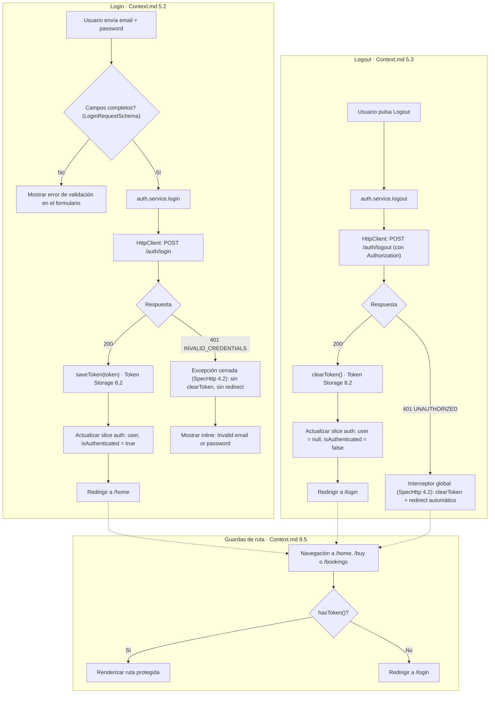

# SpecAuth.md — TicketFlow (React)

> Versión: 1.0.0
> Fuente de verdad: `Context.md` (v1.6.0, secciones 5.2, 5.3, 6.1, 7.1, 7.3, 8.2, 8.3, 8.4, 8.5) y `docs/ticketflow-api.postman_collection.json`
> Alcance de este Spec: el flujo de autenticación (login, logout, sincronización con las rutas protegidas) tal como lo exige la regla de dependencia unidireccional de la sección 7.3: **Authentication depende de HTTP Client, nunca al revés.**
> Este documento **no redefine ni reimplementa** el módulo de Token Storage ni los interceptores — ambos quedaron cerrados en `SpecHttp.md` (que a su vez traduce `Context.md` 8.2 y 8.3). Aquí sólo se indica, por nombre, cómo el flujo de login/logout los invoca.

---

## 1. Regla de dependencia (recordatorio obligatorio, Context.md 7.3)

> "La autenticación se construye **usando** el HTTP Client ya completo y su módulo de Token Storage. **Consume, no redefine.**"

En la práctica, para este Spec eso significa:

- Ninguna función de Token Storage (`saveToken`, `getToken`, `clearToken`, `hasToken`) se vuelve a declarar aquí. Se referencian tal como están fijadas en `SpecHttp.md` sección 3.
- Ningún comportamiento de interceptor (adjuntar `Authorization`, manejo de `401`/`403`/`500`, la excepción cerrada de `POST /auth/login`) se vuelve a describir aquí como si fuera nuevo. Se referencia tal como está fijado en `SpecHttp.md` sección 4.
- Si algo de este flujo necesitara cambiar el comportamiento del HTTP Client, eso sería una señal de que el diseño está mal — la regla de 7.3 existe precisamente para que Authentication nunca tenga que "volver atrás" a completar el HTTP Client.

---

## 2. Login — flujo (Context.md 5.2)

### 2.1 Validación de cliente

`Context.md` 5.2 exige: *"Fields are required — show validation error if empty on submit"*. Esta regla se resuelve con el mismo esquema de datos que valida el payload de salida (`LoginRequestSchema` — ver sección 5), no con una comprobación manual duplicada: si `email` o `password` llegan vacíos, el propio parseo del esquema falla y ese es el error de validación que se muestra. No existe una segunda fuente de verdad para "campos requeridos".

Esta validación de cliente ocurre **antes** de invocar el servicio de autenticación — si falla, no se llega a construir ninguna petición HTTP.

### 2.2 Envío

1. El formulario, ya validado, invoca al servicio de autenticación (`auth.service`, `SpecProject.md` 8.1/2.2) con `email` y `password`.
2. `auth.service` delega en el `HttpClient` (`SpecHttp.md` sección 1) para hacer `POST /auth/login`. El interceptor de request (`SpecHttp.md` 4.1) intenta adjuntar `Authorization` si `getToken()` devolviera algo — en este punto normalmente no hay token, así que la petición sale sin ese header; esto es transparente para el flujo de login, no requiere ningún caso especial.

### 2.3 Éxito (200)

1. La respuesta se valida contra `LoginResponseSchema` (sección 5) — no se acepta un `token` o un `user` con una forma distinta a la confirmada en el Postman collection.
2. `auth.service` invoca `saveToken(token)` — por nombre, tal como está fijado en `SpecHttp.md` 3 / `Context.md` 8.2. Este es el único punto de todo el proyecto donde se llama a `saveToken`.
3. La feature de login actualiza la slice `auth` (`Context.md` 8.4: `user`, `isAuthenticated`) con el `user` recibido y `isAuthenticated = true`.
4. Se redirige a `/home`.

### 2.4 Error de negocio — `INVALID_CREDENTIALS` (401)

Este es el caso ya resuelto por la **excepción cerrada** de `SpecHttp.md` 4.2 / `Context.md` 8.3: como la petición que falló es exactamente `POST /auth/login`, el interceptor de response **no** ejecuta `clearToken()` ni redirige — propaga el error tal cual hasta quien hizo la llamada.

El componente de login recibe ese error y muestra el mensaje inline exigido por `Context.md` 5.2: *"Invalid email or password"*. No se llama a `clearToken()` (no había token que limpiar) ni se navega a ningún lado — el usuario permanece en `/login` para reintentar.

### 2.5 `UNAUTHORIZED` no ocurre en este endpoint

`UNAUTHORIZED` (401) es el código que devuelven los endpoints **protegidos** cuando falta el token o es inválido (`SpecHttp.md` 5.2). `POST /auth/login` es público — nunca lo devuelve. El único `401` posible en login es `INVALID_CREDENTIALS` (sección 2.4). Este Spec no contempla un caso de `UNAUTHORIZED` en el login porque el contrato del Postman collection no lo produce ahí; si algún flujo futuro necesitara distinguirlo, tendría que confirmarse primero contra el backend, no asumirse.

---

## 3. Logout — flujo (Context.md 5.3)

### 3.1 Envío

1. El botón **Logout** del sidebar invoca a `auth.service` para hacer `POST /auth/logout`.
2. Es un endpoint protegido: el interceptor de request adjunta `Authorization: Bearer <token>` leyendo `getToken()` — comportamiento estándar ya fijado en `SpecHttp.md` 4.1, sin ninguna variación para logout.

### 3.2 Éxito (200)

1. `auth.service` invoca `clearToken()` — por nombre, tal como está fijado en `SpecHttp.md` 3 / `Context.md` 8.2.
2. La feature de logout resetea la slice `auth` (`isAuthenticated = false`, `user = null`).
3. Se redirige a `/login`.

### 3.3 Error — `UNAUTHORIZED` (401)

Si el token ya era inválido en el momento de pulsar Logout (por ejemplo, expiró justo antes), la respuesta es `401 UNAUTHORIZED`. A diferencia del login, `POST /auth/logout` **no** tiene excepción — es un endpoint protegido normal. Eso significa que este caso ya lo resuelve el interceptor global de `SpecHttp.md` 4.2 por su cuenta: `clearToken()` + redirección a `/login`, sin que la feature de logout necesite ningún manejo adicional. El resultado observable es el mismo (el usuario termina deslogueado en `/login`), sólo que por el camino global en vez del camino explícito de la sección 3.2.

**Consecuencia de diseño:** la feature de logout no necesita un `catch` especial para `401` — ese caso ya está cubierto antes de que el error le llegue.

---

## 4. Sincronización con rutas protegidas (Context.md 8.5)

Las guardas de `/home`, `/buy` y `/bookings` resuelven **llamando directamente a `hasToken()`** (`Context.md` 8.5: *"El guard... resuelve por checking hasToken() (8.2) antes de renderizar"*), no leyendo la slice `auth`. Esto es intencional y resuelve un problema real de sincronización:

- Cuando el interceptor global fuerza un logout por un `401` inesperado (por ejemplo, en medio de la pantalla de Bookings, no durante login/logout), `http/` llama a `clearToken()` — pero `http/` nunca puede actualizar la slice `auth` directamente, porque eso violaría la dirección de dependencia de `SpecProject.md` (`http/` no conoce `state/`).
- Como la guarda usa `hasToken()` y no la slice, el siguiente intento de navegación a una ruta protegida ya la bloquea correctamente, sin depender de que la slice se haya actualizado.
- La slice `auth` sólo queda "desactualizada" en la práctica dentro del mismo render en el que ocurrió el `401` forzado — y ese render deja de ser relevante en cuanto la redirección global lleva al usuario a `/login`, que no consume la slice.

Ningún Spec de feature debe intentar "arreglar" esto suscribiendo `state/` a eventos de `http/` — no hace falta, y complicaría la regla de dirección de dependencia sin necesidad.

---

## 5. Esquemas del recurso `auth` (nombres, sin redefinir campos ya fijados en SpecHttp.md)

Por convención de `SpecProject.md` 3.4, un esquema por endpoint documentado, usando exactamente los campos ya confirmados en `SpecHttp.md` 7.2/7.3 — ninguno se repite aquí con una forma distinta:

| Esquema | Cubre | Campos (fuente: SpecHttp.md) |
|---|---|---|
| `LoginRequestSchema` | Body de `POST /auth/login` | `email`, `password` |
| `LoginResponseSchema` | Respuesta `200` de `POST /auth/login` | `token`, `user: { id, name, lastname, email, phone }` |
| `LogoutResponseSchema` | Respuesta `200` de `POST /auth/logout` | `message` |

El error `INVALID_CREDENTIALS`/`UNAUTHORIZED` no necesita un esquema propio — ambos usan `ApiErrorSchema` (`SpecHttp.md` sección 5), común a todo el proyecto.

---

## 6. Diagrama Mermaid — flujo de autenticación

---

## 7. Fuera de alcance de este Spec

- El diseño visual del formulario de login (toggle de mostrar/ocultar password, botones deshabilitados "Create account" / "Forgot your password?") — ya descrito en `Context.md` 5.2 como UI, sin lógica de autenticación asociada (son `// TODO`, sección 9).
- La obtención del perfil completo del usuario (`GET /users/me`) para el sidebar de Home — pertenece a la feature Home, no a Authentication (consume la slice `auth` ya poblada por login, o hace su propia llamada; esa decisión es de `SpecProject.md`/feature Home, no de este Spec).
- El mecanismo concreto de navegación (React Router u otro) usado en "Redirigir a /home" / "Redirigir a /login" — se resuelve en el Spec que traduzca `routes/`.
