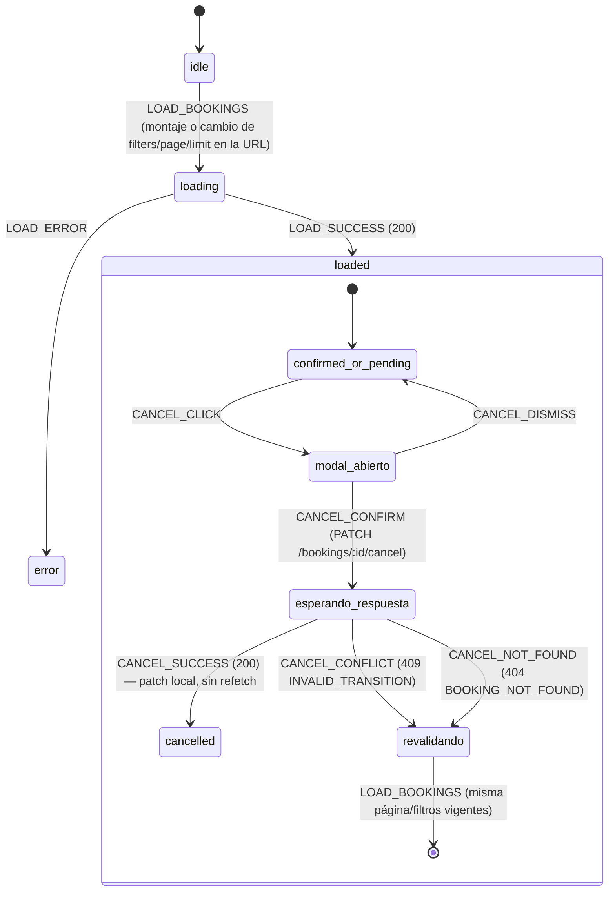

# SpecBookings.md — TicketFlow (React)

> Versión: 1.0.0
> Fuente de verdad: `Context.md` (v1.6.0, secciones 3.1, 3.2.1, 5.5, 6.3, 8.4) y `docs/ticketflow-api.postman_collection.json`
> Alcance de este Spec: la pantalla `/bookings` completa — filtros como estado de URL, debounce del filtro de texto, paginación, la FSM de la slice `bookings` (`Context.md` 8.4) con sus dos ramas de error de negocio (`BOOKING_NOT_FOUND`, `INVALID_TRANSITION`), y el patrón de actualización al cancelar con su Revalidation posterior.
> Autosuficiente desde `Context.md` + Postman (principio de 3.2.1); consistente con `SpecState.md` sección 5, sin depender de él para poder leerse. No redefine el HTTP Client, sus interceptores, ni el principio general de Revalidation (`SpecState.md` 7.2) — los usa por nombre.

---

## 1. URL como fuente de verdad para los filtros (Context.md 5.5)

> *"Filters are serialized as URL query params — the URL is the source of truth."*

Los cuatro filtros y los dos parámetros de paginación se mapean 1:1 con los query params de `GET /bookings` (`SpecHttp.md` 7.9):

| Query param | Filtro / control en la UI |
|---|---|
| `eventName` | Búsqueda por evento (texto libre) |
| `status` | Select: `confirmed` \| `pending` \| `cancelled` |
| `dateFrom` | Selector de fecha (`YYYY-MM-DD`) |
| `dateTo` | Selector de fecha (`YYYY-MM-DD`) |
| `page` | Página actual (por defecto `1`) |
| `limit` | Tamaño de página (por defecto `10`, máximo `50` — límite del servidor) |

**Regla de una sola dirección de escritura:** los campos `filters`, `page` y `limit` de la slice `bookings` (`Context.md` 8.4) **no son un estado independiente** que un formulario controle por su cuenta — son un espejo derivado de la URL actual. El flujo es: el usuario cambia un control de filtro → se actualiza la URL (nuevos query params) → la slice relee esos parámetros de la URL → se dispara `LOAD_BOOKINGS` (sección 5). Ningún componente escribe `filters`/`page`/`limit` directamente sin pasar por la URL — evitar esto es lo que impide tener dos fuentes de verdad (la URL y un estado de formulario) que puedan desincronizarse, por ejemplo al usar el botón "atrás" del navegador.

---

## 2. Debounce en `eventName`

`Context.md` 5.5 deja esto explícitamente abierto: *"Filters are applied in real time (debounced) or on submit button — TBD per framework."* Como framework ya elegido es React (`SpecProject.md`), este Spec resuelve ese "TBD" así:

| Filtro | Comportamiento |
|---|---|
| `eventName` | **Debounced.** Es texto libre de escritura continua (coincidencia parcial `LIKE %value%`, `SpecHttp.md` 7.9) — actualizar la URL en cada tecla generaría una petición de red por carácter. Se espera una pausa en la escritura antes de reflejar el valor en la URL y disparar `LOAD_BOOKINGS`. |
| `status`, `dateFrom`, `dateTo` | **Inmediato.** Son selecciones discretas (un select, dos date pickers), no escritura continua — no hay ráfaga de eventos que debounced necesite absorber. |

`Context.md` no fija un valor de milisegundos para el debounce — no se inventa un número como si estuviera confirmado por el PRD; queda como parámetro de implementación a decidir por quien construya la feature.

---

## 3. Paginación (Context.md 5.5)

- Controlada enteramente por `page` y `limit` en la URL (sección 1) — no por un contador local.
- La barra de paginación (Previous, números de página, Next) se construye a partir del objeto `pagination` que devuelve `GET /bookings` (`SpecHttp.md` 7.9): `{ page, limit, total, totalPages }` — estos cuatro valores **siempre vienen del servidor**, nunca se calculan en el cliente a partir de `items.length` (evita que la paginación quede desincronizada si `items` se modifica localmente, ver sección 6).
- `limit` por defecto es `10` (5.5: "Default: 10 records per page"); el servidor lo limita a `50` como máximo (`SpecHttp.md` 7.9) — si la UI permitiera pedir más, el servidor lo recortaría igual, así que la UI no necesita duplicar esa validación para que el contrato se respete.
- **Estado vacío:** cuando `pagination.total === 0`, se muestra la ilustración + *"You have no bookings yet"* + CTA **"Buy your first ticket"** → `/buy` (5.5). No es un estado nuevo de la FSM (sección 5) — es una condición derivada de `items.length === 0` / `pagination.total === 0`, igual que el ítem de navegación activo en `SpecLayout.md` se deriva en vez de guardarse aparte.

---

## 4. FSM de la slice `bookings` (Context.md 8.4)

### 4.1 Campos (sin cambios)

| Campo | Contenido |
|---|---|
| `filters` | `{ eventName?, status?, dateFrom?, dateTo? }` — espejo de la URL (sección 1) |
| `page`, `limit` | Espejo de la URL (sección 1) |
| `items` | `data[]` de `GET /bookings` (`SpecHttp.md` 7.9) |

Como ya se estableció en `SpecState.md` 5.1 (reconstruido aquí de forma autosuficiente): `filters`/`page`/`limit` son **estado de consulta** (sin FSM propia, cambian libremente y disparan un nuevo `LOAD_BOOKINGS`); `items` sí tiene una FSM real, **por elemento**.

### 4.2 FSM de carga de la lista

| Estado | Acción | Guarda | Efecto |
|---|---|---|---|
| `idle` | `LOAD_BOOKINGS` | Entrada a `/bookings`, o cualquier cambio de `filters`/`page`/`limit` vía URL (sección 1) | → `loading` |
| `loading` | `LOAD_SUCCESS` | `200` | `items = data[]`, se guarda `pagination` → `loaded` |
| `loading` | `LOAD_ERROR` | Fallo de red u otro error no cubierto por un código de negocio específico | → `error` |

`GET /bookings` no tiene, en el Postman collection, ningún código de error de negocio propio más allá de `401` (ya cubierto globalmente por el interceptor, `SpecHttp.md` 4.2) — por eso esta FSM de carga no tiene una rama de error de negocio dedicada; sólo la genérica.

### 4.3 FSM por booking (`items[i].status`, Context.md 6.3)

```
[confirmed] ──→ [cancelled]  (terminal)
[pending]   ──→ [cancelled]  (terminal)
[cancelled] ──→ ✗            (no hay transición — 409 INVALID_TRANSITION)
```

| Estado | Acción | Guarda | Efecto |
|---|---|---|---|
| `confirmed` / `pending` | `CANCEL_CLICK` | Botón visible/habilitado sólo si el status es uno de estos dos (5.5) | Abre modal de confirmación: *"Are you sure you want to cancel this booking?"* (5.5) — no cambia el estado todavía |
| (modal abierto) | `CANCEL_CONFIRM` | Usuario confirma en el modal | Dispara `PATCH /bookings/:id/cancel` |
| (modal abierto) | `CANCEL_DISMISS` | Usuario cierra el modal sin confirmar | Vuelve a `confirmed`/`pending` sin ninguna llamada de red |
| `confirmed` / `pending` (esperando respuesta) | `CANCEL_SUCCESS` | `200` de `PATCH /bookings/:id/cancel` | Patch local del item: `status = "cancelled"`, `cancelledAt = <respuesta>` (sección 6) |
| `confirmed` / `pending` (esperando respuesta) | `CANCEL_CONFLICT` | `409 INVALID_TRANSITION` (`SpecHttp.md` 5.1) | Revalidation (sección 6.3) |
| `confirmed` / `pending` (esperando respuesta) | `CANCEL_NOT_FOUND` | `404 BOOKING_NOT_FOUND` (`SpecHttp.md` 5.1) | Revalidation (sección 6.4) |
| `cancelled` | — | — | Estado terminal — el botón Cancelar ya no se muestra (guarda de 5.5), no hay acción posible |

---

## 5. Diagrama Mermaid — FSM de bookings



---

## 6. Actualización al cancelar y Revalidation posterior

### 6.1 Precisión sobre "Optimistic Update"

`Context.md` 5.5 dice literalmente: *"On success → update row status in table (optimistic update)"*. Léase con cuidado: la actualización ocurre **tras el `200`**, no antes de enviar la petición. Lo "optimista" del patrón, tal como lo nombra el propio PRD, es evitar un refetch completo de la lista (`GET /bookings` de nuevo) y en su lugar **parchear localmente** el único item afectado usando los campos que ya devuelve la respuesta de `PATCH /bookings/:id/cancel` (`id`, `status`, `cancelledAt`, `SpecHttp.md` 7.10) — no releer toda la tabla para un cambio de una sola fila.

Este Spec no introduce, además, un patrón de optimismo *previo* a la respuesta (mostrar `cancelled` antes de que el servidor confirme, con lógica de reversión si falla) — `Context.md` no describe ese comportamiento, y añadirlo sería inventar una regla de UX no confirmada. Lo que sí exige el encargo, y sí está bien fundado en el contrato, es la Revalidation para cuando el servidor **rechaza** la suposición local — eso se resuelve en 6.3 y 6.4.

### 6.2 Patch local en éxito (`CANCEL_SUCCESS`)

Sólo se sobrescriben los dos campos que la respuesta realmente trae — el resto del objeto booking (evento, asiento, total, etc.) se conserva tal cual estaba, porque `PATCH /bookings/:id/cancel` no los devuelve (`SpecHttp.md` 7.10: la respuesta es únicamente `{ id, status, cancelledAt }`):

```json
{ "id": "TF-001", "status": "cancelled", "cancelledAt": "2026-07-04T16:00:00.000Z" }
```

### 6.3 Revalidation ante `INVALID_TRANSITION` (409)

Ya definida en `SpecState.md` 7.2/7.3, reconstruida aquí para autosuficiencia: si el servidor responde `409` a un intento de cancelar, significa que el booking **ya estaba cancelado** en el servidor (por ejemplo, otra pestaña de la misma sesión ya lo canceló) — la copia local (`confirmed`/`pending`) estaba desactualizada. No se aplica el patch de 6.2; en su lugar, se vuelve a pedir el estado real con `GET /bookings` usando los mismos `filters`/`page`/`limit` ya vigentes en la slice (mismo mecanismo de `LOAD_BOOKINGS`, sección 4.2 — no un endpoint distinto), y el item revalidado (ya `cancelled`) reemplaza al local. El botón Cancelar desaparece de inmediato porque la guarda de 5.5 ya no se cumple.

### 6.4 Revalidation ante `BOOKING_NOT_FOUND` (404)

Caso distinto, con una causa real y concreta en este proyecto: la base de datos del backend es SQLite en memoria y **se reinicia a la semilla original en cada reinicio del contenedor** (`Context.md` 3.1: *"resets on every container restart"*). Si el contenedor se reinició entre el último `GET /bookings` y el intento de cancelar, el `id` de booking que la slice tiene en memoria puede ya no existir en el backend — de ahí `404 BOOKING_NOT_FOUND` (`SpecHttp.md` 5.1: *"Cancellation of a nonexistent booking"*).

La respuesta es la misma Revalidation que 6.3: no se asume que el item simplemente desapareció (eso cambiaría `pagination.total` sin que el cliente supiera el nuevo valor correcto) — se vuelve a pedir la página actual completa con `GET /bookings`, y se reemplaza `items` y `pagination` con lo que el servidor confirme.

**Pendiente de confirmación:** si tras esa revalidación la página actual queda vacía (por ejemplo, era el último item de la última página), `Context.md` no especifica si la UI debe navegar automáticamente a la página anterior o mostrar el estado vacío de esa página tal cual. No se asume ninguna de las dos — se señala como hueco real, no se resuelve por inferencia.

---

## 7. Fuera de alcance de este Spec

- El valor exacto en milisegundos del debounce de `eventName` (sección 2) — parámetro de implementación, no fijado por `Context.md`.
- El diseño visual de la tabla, el modal de confirmación y la barra de paginación — este Spec define su comportamiento, no su maquetación.
- El resto de las slices (`auth`, `purchase`, `seatMap`) — cubiertas por `SpecAuth.md`, `SpecPurchase.md` y `SpecSeatMap.md` respectivamente.
