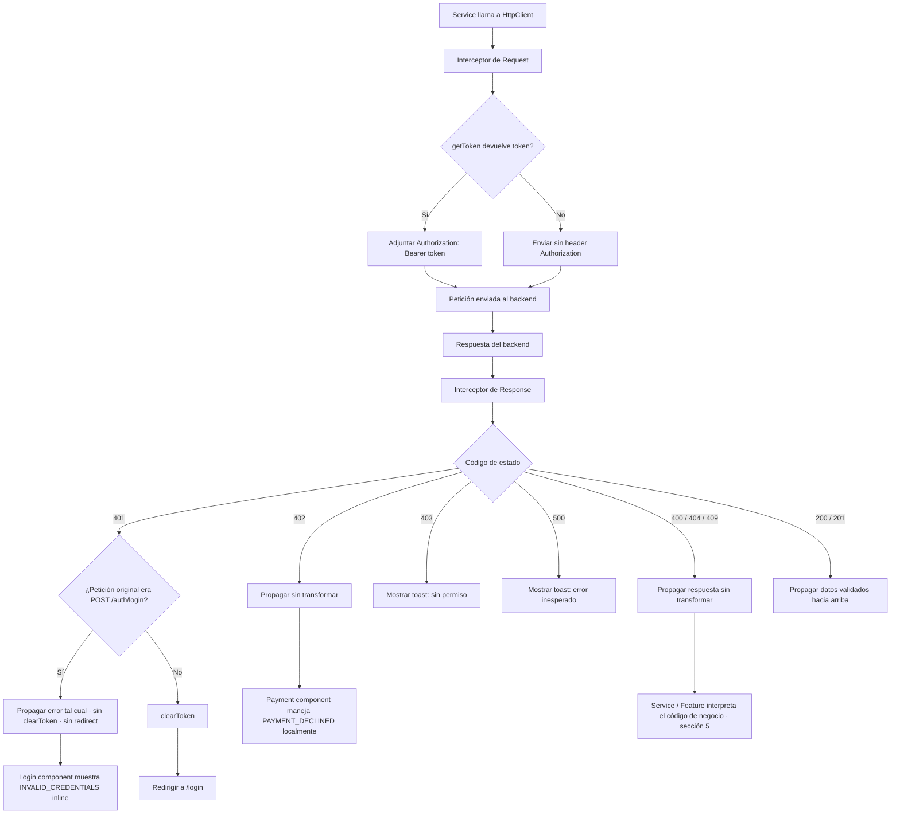

# SpecHttp.md — TicketFlow (React)

> Versión: 1.0.0
> Fuente de verdad: `Context.md` (v1.6.0, secciones 3.2.1, 7 y 8.2/8.3) y `docs/ticketflow-api.postman_collection.json`
> Alcance de este Spec: capa `http/` completa — configuración base, Token Storage, interceptores, catálogo de errores y **el payload exacto de cada endpoint**, tal como lo exige la regla de propiedad unidireccional de la sección 7.3 (el HTTP Client se resuelve aquí, de una sola vez, sin depender de nada definido en Authentication ni en ningún otro Spec).
> Este Spec no redefine carpetas ni convenciones — usa exactamente las fijadas en `SpecProject.md` (`http/`, `schemas/`, `services/`).
> **Ningún campo, endpoint o código de error de este documento proviene de una inferencia** — todos están tomados literalmente de `ticketflow-api.postman_collection.json`. Donde ese archivo no lo confirma, se marca explícitamente como pendiente en vez de asumirlo.

---

## 1. Cliente HTTP: decisión ya fijada, no Axios

`SpecProject.md` (sección 0) ya resolvió esta decisión: el cliente HTTP es un **módulo propio (`HttpClient`) construido sobre `fetch` nativo**, no una librería de terceros como Axios. Este Spec no la reabre — la razón sigue siendo la misma que cierra `Context.md` 7.3: el HTTP Client debe quedar completo y autosuficiente únicamente con lo que se define en las secciones 7 y 8.2/8.3 del PRD, sin traer una dependencia externa que imponga su propio modelo de interceptores.

Todo lo que sigue en este documento (configuración base, Token Storage, interceptores) describe el contrato de ese módulo `HttpClient`, no una integración con Axios.

---

## 2. Configuración base (Context.md 7.2)

| Parámetro | Valor |
|---|---|
| `baseURL` | `http://localhost:3000` |
| `timeout` | `10000` ms |
| Header por defecto | `Content-Type: application/json` |

Esta configuración es la única fuente de verdad para `baseURL`, `timeout` y headers por defecto — ningún servicio (`services/`) ni feature la redefine o la sobreescribe por endpoint.

---

## 3. Token Storage — interfaz de referencia (Context.md 8.2)

Se traduce sin cambios de nombre ni de forma. Es la única pieza de estado global que vive dentro de `http/` (no es una slice de `state/`, porque los interceptores dependen de ella para funcionar — 7.3).

| Función | Parámetros | Retorno | Se usa en |
|---|---|---|---|
| `saveToken` | `token: string` | `void` | Login, tras `200` de `POST /auth/login` |
| `getToken` | — | `string \| null` | Interceptor de request (sección 4.1) |
| `clearToken` | — | `void` | Logout, e interceptor de response ante `401` (sección 4.2) |
| `hasToken` | — | `boolean` | Guardas de ruta (`routes/`, `Context.md` 8.5) |

Ningún otro módulo del proyecto lee o escribe el token por otra vía (por ejemplo, accediendo directo a `localStorage`) — todo pasa por estas cuatro funciones, para que el mecanismo de almacenamiento (8.2 no fija localStorage vs memoria a nivel de interfaz, aunque `Context.md` 10 sí exige `localStorage` como requisito no funcional) se pueda cambiar sin tocar nada fuera de `http/`.

---

## 4. Interceptores (Context.md 7.1 + 8.3)

### 4.1 Interceptor de request

Contrato (8.3): antes de enviar cualquier petición, se llama a `getToken()`. Si devuelve un token, se adjunta `Authorization: Bearer <token>` a la petición. Si devuelve `null`, la petición se envía sin ese header.

Este interceptor no distingue entre endpoints públicos y protegidos — esa distinción no le corresponde a `http/` (mantiene la capa agnóstica de qué recurso se está pidiendo, según el principio de Separation of Concerns de `SpecProject.md`). Adjuntar el header a una petición pública (`POST /auth/login`, `GET /health`) es inofensivo porque el backend simplemente no lo exige ahí.

### 4.2 Interceptor de response

Contrato (8.3 + 7.1): al recibir la respuesta, se evalúa el código de estado HTTP.

| Código | Acción del interceptor | Alcance |
|---|---|---|
| `401` | **Excepción cerrada (8.3):** si la petición que originó la respuesta fue `POST /auth/login`, el error se propaga tal cual, sin `clearToken()` ni redirección — el componente de login necesita mostrar `INVALID_CREDENTIALS` de forma inline. **Para cualquier otra petición:** se llama a `clearToken()` y se dispara la redirección a `/login` (el mecanismo concreto de navegación lo resuelve el Spec que traduzca el router). | Global, con la única excepción nombrada arriba — no hay más endpoints públicos en el proyecto (3.2), así que no se necesita una regla genérica de "endpoints públicos". |
| `402` | No se maneja en el interceptor. Se deja propagar sin transformar hasta el componente de pago. | Local — únicamente lo consume el paso de Pago (`features/purchase/payment`), nunca el interceptor global. |
| `403` | Se muestra un toast genérico: *"No tienes permiso para esta acción"*. | Global. |
| `500` | Se muestra un toast genérico: *"Ha ocurrido un error inesperado. Inténtalo de nuevo."* | Global. |
| `400`, `404`, `409` | El interceptor no define una acción global para estos códigos (no está en 7.1). La respuesta (incluido el `error` de negocio del body) se propaga sin transformar hasta el `service`/`feature` que hizo la llamada, que es quien decide cómo mostrarla usando el catálogo de la sección 5. | Local a cada llamada — no hay comportamiento genérico definido por el PRD para estos tres códigos. |

**Nota sobre `UNAUTHORIZED` vs `INVALID_CREDENTIALS`:** ambos son `401`, pero nunca ocurren en la misma petición. `INVALID_CREDENTIALS` sólo lo devuelve `POST /auth/login` (la excepción de la tabla anterior). `UNAUTHORIZED` lo devuelven todos los demás endpoints protegidos cuando falta el token o es inválido — a ese caso sí le aplica `clearToken()` + redirección.

### 4.3 Diagrama Mermaid — flujo de interceptores



---

## 5. Catálogo de errores

Todas las respuestas de error del backend comparten la misma forma (confirmada en la descripción de la colección Postman, "Error shape (all errors)"):

```json
{ "error": "ERROR_CODE", "message": "Human readable description" }
```

Este es el único esquema de error de todo el proyecto (`schemas/api-error` en `SpecProject.md`) — ningún endpoint devuelve una forma de error distinta.

### 5.1 Errores de negocio

Requieren casi siempre un mensaje distinto al genérico; se interpretan en el `service`/`feature` correspondiente, nunca en el interceptor global (sección 4.2):

| Código | HTTP | Contexto | Endpoint donde ocurre | Dónde se interpreta |
|---|---|---|---|---|
| `INVALID_CREDENTIALS` | 401 | Login con email o password incorrectos | `POST /auth/login` | Componente de Login (excluido del interceptor global de 401) |
| `EVENT_NOT_FOUND` | 404 | Evento inexistente al pedir sus asientos | `GET /events/:id/seats` | Feature de compra, paso "Select Your Seat" |
| `SEAT_UNAVAILABLE` | 409 | Intento de reservar un asiento ya ocupado | `POST /bookings` | Feature de compra, paso "Payment" (tras el intento de creación de la reserva) |
| `BOOKING_NOT_FOUND` | 404 | Cancelación de una reserva inexistente | `PATCH /bookings/:id/cancel` | Feature de Bookings, acción de cancelar |
| `INVALID_TRANSITION` | 409 | Cancelación de una reserva ya cancelada | `PATCH /bookings/:id/cancel` | Feature de Bookings, acción de cancelar |
| `PAYMENT_DECLINED` | 402 | Pago rechazado por la simulación (10% de los casos) | `POST /payment/process` | Componente de Payment (excluido del interceptor global, sección 4.2) |

### 5.2 Errores de validación e infraestructura

Genéricos, no específicos del dominio; normalmente cubiertos por el manejo genérico de código HTTP de 7.1 cuando existe (401 y 500), y propagados sin transformar en los demás casos:

| Código | HTTP | Contexto | Endpoint(s) donde ocurre | Manejo |
|---|---|---|---|---|
| `VALIDATION_ERROR` | 400 | Body de la petición con campos inválidos o faltantes | `POST /auth/login`, `POST /payment/process`, `POST /bookings` | Sin regla global (7.1 no cubre 400) — se interpreta donde se originó la petición. |
| `UNAUTHORIZED` | 401 | Petición protegida sin token o con token inválido | Todos los endpoints protegidos, excepto `POST /auth/login` | Interceptor global de 401 (sección 4.2): `clearToken()` + redirección. |
| `USER_NOT_FOUND` | 404 | Usuario inexistente (p. ej. `GET /users/me` con token inválido) | `GET /users/me` | Sin regla global (7.1 no cubre 404) — se interpreta donde se originó la petición. |
| `NOT_FOUND` | 404 | Recurso genérico no encontrado, fuera de los casos específicos anteriores | Confirmado por el backend como código existente; el Postman collection no documenta un ejemplo concreto de request/response para este caso — **pendiente de confirmación** en qué endpoint puede aparecer. | Sin regla global — se interpretaría donde se origine, si llega a ocurrir. |
| `INTERNAL_SERVER_ERROR` | 500 | Error no controlado del backend | Cualquier endpoint | Interceptor global de 500 (sección 4.2): toast genérico. |

**Regla de cierre (3.2.1):** ningún Spec de feature añade un código de error fuera de estas dos tablas. Si un caso de error no está aquí, se marca como pendiente de confirmación contra el backend real, no se inventa.

---

## 6. Idempotency Key = reenvío de `transactionId`

`Context.md` 3.2.1 confirma, contra el backend real, que `POST /payment/process` recibe **únicamente** el campo `method` (`card` | `paypal`). No existe un campo `simulated` ni un header de idempotencia.

El mecanismo real de idempotencia de este proyecto es distinto: el `transactionId` que devuelve `POST /payment/process` se reenvía como parte del body de `POST /bookings`, en `payment.transactionId`. Esa reutilización del `transactionId` — no un header nuevo — es la implementación del concepto de "Idempotency Key": identifica de forma única el pago ya aprobado que autoriza crear la reserva.

**Regla explícita para el resto de Specs:** cualquier documento que mencione "Idempotency Key" en este proyecto describe este mecanismo (reenvío de `transactionId` en el body). Ninguno introduce un header `Idempotency-Key`, ni un campo `simulated`, ni ningún otro mecanismo — hacerlo sería inventar un dato no respaldado por el contrato.

---

## 7. Catálogo completo de endpoints — payload exacto

> Fuente: `ticketflow-api.postman_collection.json`. Cada bloque JSON es un ejemplo literal tomado de la colección — no una plantilla inferida. Los campos marcados "no documentado" son huecos reales del Postman collection, no inferencias.

### 7.1 `GET /health` — Público

Sin body de request. No requiere `Authorization`.

**200 OK**
```json
{ "status": "ok" }
```

> No forma parte de ninguna pantalla documentada en `Context.md` (sección 5) — su único uso confirmado por el Postman collection es como liveness probe. Se documenta aquí por completitud (el encargo pide "todos los endpoints"), pero su consumo desde el frontend queda pendiente de confirmación.

---

### 7.2 `POST /auth/login` — Público

**Request body**
```json
{
  "email": "sofia.hernandez@ticketflow.com",
  "password": "ticket123"
}
```
Campos requeridos: `email` (string), `password` (string).

**200 OK**
```json
{
  "token": "tok_550e8400-e29b-41d4-a716-446655440000",
  "user": {
    "id": "usr-001",
    "name": "Sofía",
    "lastname": "Hernández",
    "email": "sofia.hernandez@ticketflow.com",
    "phone": "+525511223344"
  }
}
```
`token` tiene siempre el prefijo `tok_`.

**400 Bad Request**
```json
{ "error": "VALIDATION_ERROR", "message": "email and password are required" }
```

**401 Unauthorized**
```json
{ "error": "INVALID_CREDENTIALS", "message": "Invalid email or password" }
```

---

### 7.3 `POST /auth/logout` — Protegido

Sin body de request. Header requerido: `Authorization: Bearer <token>`.

**200 OK**
```json
{ "message": "Logged out successfully" }
```

**401 Unauthorized**
```json
{ "error": "UNAUTHORIZED", "message": "Invalid or missing token" }
```

---

### 7.4 `GET /users/me` — Protegido

Sin body ni parámetros. La identidad se resuelve por el token.

**200 OK**
```json
{
  "id": "usr-001",
  "name": "Sofía",
  "lastname": "Hernández",
  "email": "sofia.hernandez@ticketflow.com",
  "phone": "+525511223344"
}
```

**401 Unauthorized** — misma forma que 7.3.

---

### 7.5 `GET /events` — Protegido

Sin body ni parámetros. Sin paginación — siempre devuelve la lista completa, ordenada por `date` ASC.

**200 OK**
```json
{
  "data": [
    {
      "id": "evt-001",
      "venueId": "ven-001",
      "name": "Bad Liebre",
      "date": "2025-02-15",
      "time": "21:00",
      "location": "Ciudad de México, México",
      "imageUrl": "https://raw.githubusercontent.com/.../bad-liebre.png",
      "basePrice": 150,
      "currency": "USD"
    }
  ]
}
```
`currency` es siempre `"USD"`. **`venueType` NO está en este endpoint** — sólo se obtiene desde `GET /events/:id/seats` (confirmado en `Context.md` 5.4 Step 1 y en el schema del Postman collection).

**401 Unauthorized** — misma forma que 7.3.

---

### 7.6 `GET /events/:id/seats` — Protegido

Parámetro de ruta: `id` (ID del evento, p. ej. `evt-001`).

**200 OK**
```json
{
  "eventId": "evt-001",
  "venueType": "arena",
  "zones": [
    { "id": "zon-001", "name": "VIP", "color": "#e94560", "price": 150 },
    { "id": "zon-002", "name": "Premium", "color": "#f0a500", "price": 110 },
    { "id": "zon-003", "name": "General", "color": "#4caf50", "price": 75 }
  ],
  "seats": [
    { "seatId": "sea-001", "row": 1, "col": 1, "zone": "zon-001", "status": "occupied" },
    { "seatId": "sea-002", "row": 1, "col": 2, "zone": "zon-001", "status": "available" }
  ]
}
```
- `venueType`: `"arena"` | `"halfmoon"` | `"flat"`.
- `zones` ordenadas por `price` DESC.
- `seats` ordenados por `row` ASC, luego `col` ASC.
- `seat.status`: `"available"` | `"occupied"`.
- **Distinción crítica (confirmada en la descripción de la colección):** `seat.zone` aquí es el **ID de zona** (referencia a `zones[].id`), no el nombre. No confundir con `booking.zone` (sección 7.8/7.9), que sí es el nombre.

**401 Unauthorized** — misma forma que 7.3.

**404 Not Found**
```json
{ "error": "EVENT_NOT_FOUND", "message": "Event not found" }
```

---

### 7.7 `POST /payment/process` — Protegido

**Request body**
```json
{ "method": "card" }
```
Único campo requerido: `method` (string, enum `"card"` | `"paypal"`). No hay `simulated`, no hay header de idempotencia (sección 6).

**200 OK** (aprobado)
```json
{
  "transactionId": "txn-583921",
  "status": "approved",
  "message": "Payment approved. You will receive a confirmation email.",
  "processedAt": "2026-07-04T15:30:00.000Z"
}
```
`transactionId` sigue el patrón `txn-` + 6 dígitos. `processedAt` es ISO 8601. Delay artificial de 2–5 segundos.

**400 Bad Request**
```json
{ "error": "VALIDATION_ERROR", "message": "method must be card or paypal" }
```

**401 Unauthorized** — misma forma que 7.3.

**402 Payment Required** (10% de las llamadas, aleatorio, independiente del input)
```json
{ "error": "PAYMENT_DECLINED", "message": "Your payment was declined. Please try again." }
```

---

### 7.8 `POST /bookings` — Protegido

**Request body**
```json
{
  "eventId": "evt-001",
  "seatId": "sea-002",
  "contactEmail": "sofia.hernandez@ticketflow.com",
  "contactPhone": "+525511223344",
  "payment": {
    "method": "card",
    "transactionId": "txn-583921"
  },
  "total": 150
}
```
Requeridos: `eventId`, `seatId`, `contactEmail`, `contactPhone`, `payment` (objeto con `method` y `transactionId` — ver sección 6). Opcional: `total` (number, por defecto `0` si se omite).

**201 Created**
```json
{
  "id": "TF-583921",
  "status": "confirmed",
  "total": 150,
  "currency": "USD",
  "contactEmail": "sofia.hernandez@ticketflow.com",
  "paymentMethod": "card",
  "transactionId": "txn-583921",
  "createdAt": "2026-07-04 15:31:00",
  "cancelledAt": null,
  "eventId": "evt-001",
  "eventName": "Bad Liebre",
  "eventDate": "2025-02-15",
  "eventTime": "21:00",
  "location": "Ciudad de México, México",
  "seatId": "sea-002",
  "row": 1,
  "col": 2,
  "zone": "VIP"
}
```
- `id`: formato `TF-` + 6 dígitos.
- `cancelledAt`: siempre `null` en la creación.
- **`booking.zone` aquí es el NOMBRE de la zona** (p. ej. `"VIP"`), no el ID — distinto de `seat.zone` en 7.6.
- `createdAt` en este endpoint usa formato `datetime('now')` de SQLite (`YYYY-MM-DD HH:MM:SS`).

**400 Bad Request**
```json
{ "error": "VALIDATION_ERROR", "message": "eventId, seatId, contactEmail, contactPhone and payment are required" }
```

**401 Unauthorized** — misma forma que 7.3.

**409 Conflict**
```json
{ "error": "SEAT_UNAVAILABLE", "message": "The selected seat is not available" }
```

---

### 7.9 `GET /bookings` — Protegido

**Query params (todos opcionales)**

| Parámetro | Tipo | Detalle |
|---|---|---|
| `page` | number | Por defecto `1` |
| `limit` | number | Por defecto `10`. Máximo `50` (el servidor lo limita) |
| `status` | string enum | `confirmed` \| `pending` \| `cancelled` |
| `eventName` | string | Coincidencia parcial, `LIKE %value%`, insensible a mayúsculas |
| `dateFrom` | string | `YYYY-MM-DD`, inclusive |
| `dateTo` | string | `YYYY-MM-DD`, inclusive |

Sólo devuelve las reservas del usuario autenticado (sin acceso entre usuarios). Ordenadas por `createdAt` DESC.

**200 OK**
```json
{
  "data": [
    {
      "id": "TF-001",
      "status": "confirmed",
      "total": 150,
      "currency": "USD",
      "contactEmail": "sofia.hernandez@ticketflow.com",
      "paymentMethod": "card",
      "transactionId": "txn-483920",
      "createdAt": "2026-07-04 08:30:00",
      "cancelledAt": null,
      "eventId": "evt-001",
      "eventName": "Bad Liebre",
      "eventDate": "2025-02-15",
      "eventTime": "21:00",
      "location": "Ciudad de México, México",
      "seatId": "sea-001",
      "row": 1,
      "col": 1,
      "zone": "VIP"
    }
  ],
  "pagination": { "page": 1, "limit": 10, "total": 2, "totalPages": 1 }
}
```
- Sin resultados: `"data": []`, `"pagination": { "page": 1, "limit": 10, "total": 0, "totalPages": 0 }`.
- **`cancelledAt` aquí usa formato SQLite (`YYYY-MM-DD HH:MM:SS`) o `null`** — distinto del ISO 8601 que devuelve `PATCH /bookings/:id/cancel` (sección 7.10). No unificar ambos formatos sin confirmarlo — son literalmente distintos según la descripción de la colección.

**401 Unauthorized** — misma forma que 7.3.

---

### 7.10 `PATCH /bookings/:id/cancel` — Protegido

Parámetro de ruta: `id` (ID de la reserva, formato `TF-XXXXXX`). Sin body de request.

**200 OK**
```json
{ "id": "TF-001", "status": "cancelled", "cancelledAt": "2026-07-04T16:00:00.000Z" }
```
`cancelledAt` aquí es ISO 8601 (`new Date().toISOString()`) — no confundir con el formato de 7.9.

**401 Unauthorized** — misma forma que 7.3.

**404 Not Found**
```json
{ "error": "BOOKING_NOT_FOUND", "message": "Booking not found" }
```

**409 Conflict**
```json
{ "error": "INVALID_TRANSITION", "message": "This booking cannot be cancelled in its current state" }
```
La cancelación no es idempotente: cancelar dos veces la misma reserva devuelve este `409`, no un `200` repetido.

---

## 8. Fuera de alcance de este Spec

- La forma final de cada esquema Zod (nombres de constantes, tipos inferidos) — se define en `SpecAuth.md`, `SpecPurchase.md`, `SpecSeatMap.md` y `SpecBookings.md`, usando como única fuente de campos la sección 7 de este documento.
- El mecanismo concreto de redirección tras `clearToken()` (React Router u otro) — lo resuelve el Spec que traduzca `routes/`.
- La UI de los toasts y mensajes de error (texto exacto ya citado en `Context.md` 7.1; su presentación visual no es responsabilidad de este Spec).
