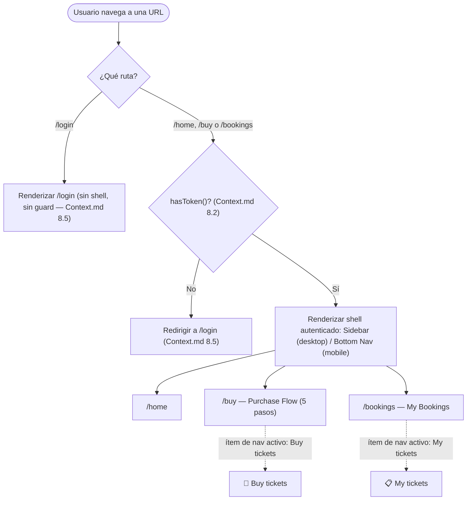

# SpecLayout.md — TicketFlow (React)

> Versión: 1.0.0
> Fuente de verdad: `Context.md` (v1.6.0, secciones 2.2, 3.4, 5.1, 5.3, 8.2, 8.5) y `docs/ticketflow-api.postman_collection.json`
> Alcance de este Spec: el shell de navegación autenticado (sidebar de escritorio / navegación inferior en móvil), la tabla de rutas y guardas (8.5) y el comportamiento de estado activo del ítem de navegación.
> Este Spec **no redefine** `hasToken()` (`Context.md` 8.2, ya traducido en `SpecHttp.md` sección 3) ni el flujo de logout (`SpecAuth.md` sección 3) — los invoca por nombre. Tampoco redefine la slice `auth` (`SpecState.md` sección 2) — la consume para leer `user` y para no leerla en las guardas (esa decisión ya quedó cerrada en `SpecAuth.md` 4).

---

## 1. Qué cubre este Spec y qué no

`Context.md` 5.1 anida `/buy` y `/bookings` bajo `/home`:

```
/login
/home
  ├── /buy          (purchase flow — 5 steps)
  └── /bookings     (my reservations)
```

Esto significa que `/home`, `/buy` y `/bookings` comparten el mismo shell de navegación (sidebar/bottom nav) — no son tres pantallas con layout propio, son tres rutas que se renderizan **dentro** del mismo contenedor. `/login` es la única ruta sin ese shell (5.2 no menciona sidebar ni nav). Este Spec define ese shell compartido y la guarda que lo protege; el contenido de cada ruta (el stepper de compra, la tabla de bookings) es responsabilidad de sus propios Specs de feature.

---

## 2. Separation of Concerns aplicado al layout

Siguiendo la cadena de responsabilidad ya fijada en `SpecProject.md` (`components ← features ← state ← services ← schemas ← http`):

| Capa | Responsabilidad en este Spec | Lo que NO hace |
|---|---|---|
| `routes/` (guardas) | Antes de renderizar `/home`, `/buy` o `/bookings`, comprobar `hasToken()` (8.2) y decidir: renderizar el shell, o redirigir a `/login` | No sabe qué hay dentro del shell, no lee la slice `auth` |
| `features/home` | Al montar el shell, invoca `users.service` (`GET /users/me`, `SpecHttp.md` 7.4) para refrescar el campo `user` de la slice `auth` (`Context.md` 5.3: *"On load → GET /users/me to display user info in sidebar"*); calcula qué ítem de navegación está activo a partir de la ruta actual (sección 5); conecta el botón de Logout con `auth.service.logout` (`SpecAuth.md` sección 3, sin reimplementarlo) | No renderiza directamente el sidebar/bottom nav — le pasa datos ya resueltos |
| `components/layout` | Sidebar (desktop), navegación inferior (mobile), ítem de navegación, resumen de usuario — componentes de presentación puros: reciben `items`, `activeRoute`, `user`, `onLogout` como datos/callbacks | No hace fetch, no conoce la slice `auth`, no conoce `hasToken()` — sigue la regla de `SpecProject.md` 1: `components/` es "tonta" |
| `state/auth` | Expone `user` (para el resumen de perfil) | No decide si una ruta se renderiza — eso lo resuelve `hasToken()` directamente, según ya cerró `SpecAuth.md` sección 4 |

---

## 3. Tabla de rutas y guardas (Context.md 8.5 — reproducida sin cambios)

| Ruta | Requiere sesión | Si no está autenticado |
|---|---|---|
| `/login` | No | — |
| `/home` | Sí | Redirige a `/login` |
| `/buy` | Sí | Redirige a `/login` |
| `/bookings` | Sí | Redirige a `/login` |

> *"El guard, en cualquier framework, resuelve comprobando `hasToken()` (8.2) antes de renderizar la ruta."* — `Context.md` 8.5.

**Consecuencia de diseño (no una regla nueva, sólo la lectura correcta de la tabla):** las tres filas protegidas son idénticas en requisito y en efecto. Como además comparten shell (sección 1), la guarda se aplica **una sola vez**, envolviendo el conjunto `/home` + `/buy` + `/bookings`, no tres veces por separado. Esto evita triplicar la misma comprobación de `hasToken()` en tres puntos distintos del árbol de rutas.

---

## 4. Estructura del Sidebar / navegación (Context.md 5.3)

### 4.1 Composición (de arriba hacia abajo)

| Sección | Contenido | Fuente de datos |
|---|---|---|
| Encabezado | Logo + wordmark de TicketFlow | Estático (2.3) |
| Navegación | Lista de ítems (tabla 4.2) | Estático (rutas + estado disabled/badge), cruzado con la ruta actual para el estado activo (sección 5) |
| Sección inferior | Avatar + nombre + email del usuario; botón **Logout** | `user` de la slice `auth` (refrescado por `GET /users/me` al montar, sección 2) |

### 4.2 Ítems de navegación (Context.md 5.3, literal)

| Icono | Etiqueta | Ruta destino | Estado | Nota |
|---|---|---|---|---|
| 🎫 | Buy tickets | `/buy` | Habilitado | Entrada al Purchase Flow (5 pasos) |
| 📋 | My tickets | `/bookings` | Habilitado | — |
| 🔍 | Explore | — | Deshabilitado, badge "Soon" | `// TODO` (`Context.md` 9) — no apunta a ninguna ruta real, no forma parte de la tabla de la sección 3 |
| ❤️ | Favorites | — | Deshabilitado, badge "Soon" | `// TODO` (`Context.md` 9) — igual que arriba |

Los dos ítems deshabilitados nunca disparan navegación ni pueden quedar en estado activo — no son rutas, son marcadores de funcionalidad futura.

### 4.3 Variante responsive (Context.md 5.3 + 3.4)

`Context.md` 5.3 define sólo dos variantes de layout: *"Fixed sidebar (desktop) / bottom navigation (mobile)"*, sin mencionar explícitamente en qué franja de la tabla de breakpoints (3.4: mobile `< 768px`, tablet `768–1024px`, desktop `> 1024px`) cae la tableta.

**Decisión de este Spec (no fijada literalmente por el PRD, se deja explícita para no ocultarla como si fuera un hecho documentado):** el corte se hace en el único breakpoint que 5.3 sí nombra por su lado "mobile" — `< 768px` usa navegación inferior; `≥ 768px` (tablet y desktop juntos) usa el sidebar fijo. Si el equipo de diseño quiere que la tableta use navegación inferior en su lugar, esto debe corregirse aquí antes de implementarse en cualquier Spec de UI.

En navegación inferior (mobile), los mismos ítems de la tabla 4.2 se muestran en una barra fija en la parte baja del viewport. **Pendiente de confirmación:** `Context.md` no especifica dónde vive la sección de usuario/Logout (4.1) cuando el layout activo es la navegación inferior — el PRD sólo la describe como parte del sidebar de escritorio. No se asume una ubicación.

---

## 5. Comportamiento del estado activo

`Context.md` 5.3: *"Active nav item highlighted with aurora-orange left border"* (token `--color-aurora-orange`, `Context.md` 2.2).

**Regla de diseño (consistente con el principio ya usado en 5.5 para los filtros de Bookings — "la URL es la fuente de verdad"):** el ítem activo **no se guarda como estado propio** en ninguna slice ni en el propio componente de navegación — se **deriva** comparando la ruta actual con la `route` de cada ítem de la tabla 4.2:

| Ruta actual | Ítem resaltado |
|---|---|
| `/buy` (en cualquiera de sus 5 pasos internos — el stepper no cambia la URL por paso, según el mapa de pantallas de 5.1) | **Buy tickets** |
| `/bookings` | **My tickets** |
| `/home` (sin subruta) | Ninguno de los dos ítems habilitados coincide exactamente — ver nota de pendiente abajo |
| Cualquier otra | Ninguno |

Guardar el ítem activo como estado duplicado (por ejemplo, en la slice `auth` o en una slice nueva) se descarta explícitamente: crearía dos fuentes de verdad que podrían desincronizarse (por ejemplo, tras una navegación por el botón "atrás" del navegador). `components/layout` recibe la ruta actual como dato y calcula el resaltado — sigue siendo un componente puro (sección 2).

**Pendiente de confirmación:** `Context.md` no especifica qué contenido renderiza `/home` cuando no hay una subruta activa, ni si navegar a `/home` redirige automáticamente a `/buy` (la anotación "(active)" junto a "Buy tickets" en 5.3 podría ser sólo el estado ilustrativo de la maqueta, no una regla de redirección). No se asume ninguna de las dos opciones.

**Pendiente de confirmación (fuera de la tabla 8.5):** `Context.md` 8.5 sólo define qué pasa si un usuario **no autenticado** visita una ruta protegida. No define qué pasa si un usuario **ya autenticado** visita `/login` directamente — no se asume que deba redirigirse a `/home`, porque esa regla no está en la tabla de la sección 3.

---

## 6. Diagrama Mermaid — tabla de rutas y guardas



---

## 7. Fuera de alcance de este Spec

- El contenido interno de `/buy` (stepper de 5 pasos) y de `/bookings` (tabla, filtros, paginación) — corresponden a `SpecPurchase.md`, `SpecSeatMap.md` y `SpecBookings.md`.
- El mecanismo concreto de enrutamiento (React Router u otro) usado para declarar rutas anidadas y ejecutar la redirección — ya se dejó pendiente en `SpecAuth.md` y `SpecHttp.md`; no se resuelve aquí tampoco.
- El texto/comportamiento exacto de la pantalla `/login` (formulario, validación) — ya cubierto por `SpecAuth.md`.
