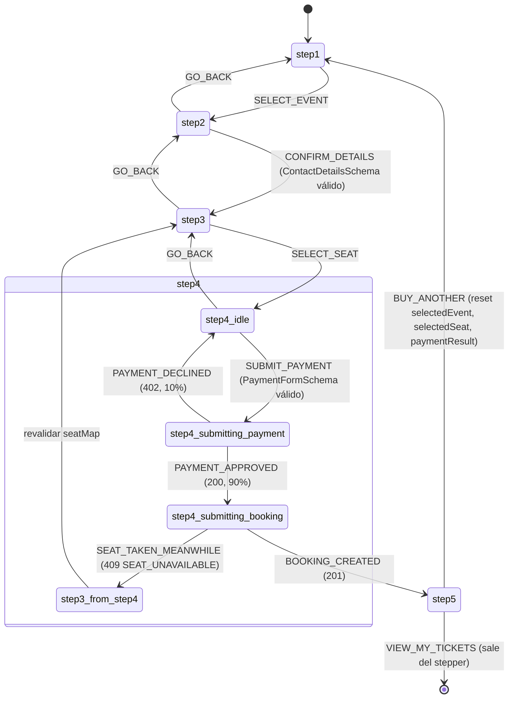

# SpecPurchase.md — TicketFlow (React)

> Versión: 1.0.0
> Fuente de verdad: `Context.md` (v1.6.0, secciones 3.2.1, 5.4, 6.2, 8.4) y `docs/ticketflow-api.postman_collection.json`
> Alcance de este Spec: la FSM completa del stepper de compra (5 pasos), la validación de formulario por paso, la estrategia de Lazy Loading, la caché en memoria del catálogo de eventos, y el ensamblado del payload **exacto** de `POST /bookings` — incluida la Idempotency Key.
> Este documento reconstruye la FSM de la slice `purchase` directamente desde `Context.md` 6.2/8.4, para ser autosuficiente (principio de la sección 3.2.1: cada Spec debe poder generarse en un chat nuevo sin depender de otro Spec). Es consistente con `SpecState.md` sección 3 (mismas fuentes), pero no depende de él para poder leerse.
> No redefine el HTTP Client, Token Storage ni interceptores (`SpecHttp.md`), ni la slice `seatMap` (`SpecState.md` sección 4) — los usa por nombre.

---

## 1. Campos de la slice `purchase` (Context.md 8.4 — sin cambios)

| Campo | Contenido |
|---|---|
| `selectedEvent` | Item de `GET /events` (id, venueId, name, date, time, location, imageUrl, basePrice, currency) — **nunca incluye `venueType`**, confirmado ausente en ese endpoint |
| `contactDetails` | `{ firstName, lastName, email, phone }` — capturado y editable en el Paso 2 |
| `selectedSeat` | Asiento elegido en el Paso 3, con la zona ya resuelta (nombre + precio), no sólo el ID de zona crudo que devuelve el backend — ver sección 4.3 |
| `paymentResult` | Respuesta `200` de `POST /payment/process`: `transactionId`, `status`, `message`, `processedAt` |

---

## 2. FSM del stepper (Context.md 6.2, con el detalle interno del Paso 4)

`Context.md` 6.2 define la FSM a nivel de paso:

```
[step-1] → [step-2] → [step-3] → [step-4] → [step-5]
                                     ↑___(pago rechazado)___|
```

Con la regla explícita: *"Steps can be navigated backwards (1→2→3→4) but not from step 5."*

### 2.1 Tabla de transiciones

| Estado | Acción | Guarda | Efecto |
|---|---|---|---|
| `step-1-select-event` | `SELECT_EVENT` | Un evento de `GET /events` está resaltado (5.4 Step 1: Next deshabilitado sin selección) | `selectedEvent = <event>` → `step-2-your-details` |
| `step-2-your-details` | `GO_BACK` | — | → `step-1-select-event` |
| `step-2-your-details` | `CONFIRM_DETAILS` | `ContactDetailsSchema` válido (sección 3.1) | `contactDetails = <form>` → `step-3-select-seat` |
| `step-3-select-seat` | `GO_BACK` | — | → `step-2-your-details` |
| `step-3-select-seat` | `SELECT_SEAT` | Seat con `status: "available"` elegido | `selectedSeat = <seat resuelto>` → `step-4-payment` (sub-estado `idle`) |
| `step-4-payment` (`idle`) | `GO_BACK` | — | → `step-3-select-seat` |
| `step-4-payment` (`idle`) | `SUBMIT_PAYMENT` | `PaymentFormSchema` válido (sección 3.2) | → `step-4-payment` (`submitting-payment`), botón deshabilitado + spinner (5.4) |
| `step-4-payment` (`submitting-payment`) | `PAYMENT_DECLINED` | `402 PAYMENT_DECLINED` de `POST /payment/process` (10% de los casos) | → `step-4-payment` (`idle`), error inline: *"Your payment was declined. Please try again."*, botón reactivado |
| `step-4-payment` (`submitting-payment`) | `PAYMENT_APPROVED` | `200` de `POST /payment/process` (90% de los casos) | `paymentResult = <payment response>` → `step-4-payment` (`submitting-booking`), sin interacción del usuario (5.4: "On success → POST /bookings") |
| `step-4-payment` (`submitting-booking`) | `BOOKING_CREATED` | `201` de `POST /bookings` (sección 4) | → `step-5-confirmation` |
| `step-4-payment` (`submitting-booking`) | `SEAT_TAKEN_MEANWHILE` | `409 SEAT_UNAVAILABLE` de `POST /bookings` (ver nota 2.2 — caso no descrito literalmente por `Context.md`) | → `step-3-select-seat`, revalidando `seatMap` (principio de Revalidation) |
| `step-5-confirmation` | `BUY_ANOTHER` | — | reinicia a `step-1-select-event`: `selectedEvent = null`, `selectedSeat = null`, `paymentResult = null` |
| `step-5-confirmation` | `VIEW_MY_TICKETS` | — | navega a `/bookings`, fuera de esta FSM |

**Regla explícita conservada:** no existe transición de retroceso desde `step-5-confirmation`.

### 2.2 Caso no descrito literalmente por Context.md — pago aprobado pero asiento ya tomado

`Context.md` 5.4 sólo describe el manejo de un pago rechazado (`402`) en el botón de Pay. No describe qué ocurre si el pago se aprueba (`200`) pero la creación de la reserva inmediatamente después falla con `409 SEAT_UNAVAILABLE` — es decir, otra persona reservó el mismo asiento en la ventana de 2–5 segundos que dura la simulación de pago. Esto es un caso real permitido por el contrato (`SEAT_UNAVAILABLE` existe precisamente para esto, `SpecHttp.md` 5.1) pero el PRD no dice qué le comunica el frontend al usuario en ese momento específico, ni si el pago simulado se considera "perdido" o reembolsable — **no hay reembolso en el contrato** (no existe un endpoint para eso), así que este Spec no lo inventa.

**Resolución aplicada (consistente con el principio de Revalidation ya fijado en `SpecState.md` 7.2, referenciado y no redefinido):** ante este `409`, no se reintenta la creación de la reserva con el mismo asiento — se vuelve al Paso 3 y se revalida el mapa de asientos (nuevo `GET /events/:id/seats`) para que el usuario elija otro asiento disponible. El texto exacto que se le muestra al usuario sobre el pago ya procesado queda **pendiente de confirmación** — no está en `Context.md` ni en el Postman collection.

---

## 3. Validación de formulario por paso

### 3.1 Paso 2 — Tus datos (`ContactDetailsSchema`)

Campos y regla, tal como los exige `Context.md` 5.4 Step 2 ("All fields required"):

| Campo | Regla |
|---|---|
| `firstName` | string, requerido |
| `lastName` | string, requerido |
| `email` | string, requerido |
| `phone` | string, requerido |

`Context.md` no exige un formato específico de email más allá de "requerido" (a diferencia de otros campos donde sí se especifica un formato, ver 3.2) — este Spec no añade una regla de formato de email no confirmada por el PRD.

Estos cuatro campos se pre-pueblan desde `GET /users/me` (`SpecHttp.md` 7.4: `name`, `lastname`, `email`, `phone`) pero quedan editables y desacoplados del perfil real (`Context.md` 5.4 Step 2: "User can edit email and phone" — este Spec extiende la misma edición a nombre/apellido por consistencia de formulario, ya que el PRD no dice que esos dos campos sean de solo lectura).

### 3.2 Paso 4 — Pago (`PaymentFormSchema`)

`Context.md` 5.4 describe dos métodos con renderizado condicional de formulario:

| Método | Campos | Regla (formato exacto ya dado por el PRD) |
|---|---|---|
| `card` | `cardNumber` | Se muestra auto-formateado como `XXXX XXXX XXXX XXXX` (16 dígitos) |
| `card` | `expirationDate` | Formato `MM/YY` |
| `card` | `cvv` | Exactamente 3 dígitos |
| `card` | `cardholderName` | string, requerido |
| `paypal` | — | Sin campos — "shows simulated redirect button" (5.4); el botón dispara el mismo flujo sin datos adicionales que validar |

**Advertencia de contrato, crítica:** estos campos del formulario de tarjeta son **exclusivamente de UX del lado del cliente** — el backend **nunca** los recibe. `POST /payment/process` acepta únicamente `{ "method": "card" | "paypal" }` (`SpecHttp.md` 7.7, confirmado por `Context.md` 3.2.1 como corrección explícita: *"removed the incorrect mention of a `simulated` field"*). Ningún campo de `PaymentFormSchema` debe filtrarse al payload real de la petición — validarlos es puramente para la experiencia de llenar el formulario, no para construir el request.

### 3.3 Pasos 1, 3 y 5 — sin formulario

- **Paso 1:** no hay campos que validar, sólo una guarda de selección (`selectedEvent != null`). El objeto guardado ya está validado por el esquema de `GET /events` (`SpecHttp.md` 7.5), no por un esquema de formulario nuevo.
- **Paso 3:** igual — guarda de selección (`selectedSeat != null`, sólo seats `available`), validado por el esquema de `GET /events/:id/seats` (`SpecHttp.md` 7.6).
- **Paso 5:** sólo lectura, sin inputs — los datos vienen ya validados de `paymentResult` y de la respuesta de `POST /bookings` (sección 4).

---

## 4. Payload exacto de `POST /bookings` (SpecHttp.md 7.8 — reproducido, no reinventado)

### 4.1 Body de la petición

```json
{
  "eventId": "evt-001",
  "seatId": "sea-002",
  "contactEmail": "sofia.hernandez@ticketflow.com",
  "contactPhone": "+525511223344",
  "payment": {
    "method": "card",
    "transactionId": "txn-583921"
  },
  "total": 150
}
```

Requeridos: `eventId`, `seatId`, `contactEmail`, `contactPhone`, `payment` (`{ method, transactionId }`). Opcional: `total` (por defecto `0` si se omite — pero este proyecto siempre lo envía calculado, sección 4.3).

**Nota de fidelidad al contrato, crítica:** el Postman collection **no incluye `firstName` ni `lastName`** entre los campos de este endpoint. `contactDetails.firstName`/`contactDetails.lastName`, capturados en el Paso 2, **no se envían** al crear la reserva — se quedan sólo en la slice `purchase` (posiblemente para mostrarse en el Paso 5, ya que `Context.md` 5.4 Step 5 no menciona el nombre en el mensaje de confirmación tampoco, sólo el email). Si en el futuro se necesitara enviarlos, habría que confirmarlo primero contra el backend — no se asume aquí.

### 4.2 Ensamblado — de la slice `purchase` al payload

| Campo del payload | Origen en `purchase` |
|---|---|
| `eventId` | `selectedEvent.id` |
| `seatId` | `selectedSeat.seatId` |
| `contactEmail` | `contactDetails.email` |
| `contactPhone` | `contactDetails.phone` |
| `payment.method` | Método elegido en el Paso 4 (`"card"` \| `"paypal"`) |
| `payment.transactionId` | `paymentResult.transactionId` — ver sección 4.4, Idempotency Key |
| `total` | Ver sección 4.3 |

### 4.3 Cálculo de `total`

`Context.md` 5.4 Step 4, resumen del pedido: *Base price + Service fee ($8.00) = Total*. El "base price" del resumen es el **precio de la zona del asiento elegido** (`selectedSeat`, ya resuelto en el Paso 3 contra `zones[]`), no el `basePrice` del evento — ese campo de `GET /events` es sólo el precio "desde" mostrado en la tarjeta del Paso 1 (*"From $XX.XX USD"*), y el propio PRD ya enseña en el Paso 3 "Dynamic pricing from zone data" como algo distinto del precio base del evento.

```
total = selectedSeat.zonePrice + 8.00
```

`8.00` (Service Fee) es una constante del proyecto (`Context.md` 5.4), no un valor que devuelva ningún endpoint — vive en `config/` (`SpecProject.md` 2), no en la slice.

### 4.4 Idempotency Key = `transactionId` (Context.md 3.2.1, reproducido sin cambios)

El `transactionId` que devuelve `POST /payment/process` (`SpecHttp.md` 7.7) se guarda en `paymentResult.transactionId` (transición `PAYMENT_APPROVED`, sección 2.1) y se reenvía tal cual en `payment.transactionId` al crear la reserva. Esa reutilización — **no un header nuevo, no un campo `simulated`** — es el mecanismo completo de Idempotency Key de este proyecto. Ningún componente de Purchase genera su propio identificador de idempotencia ni añade un header adicional a la petición.

---

## 5. Lazy Loading

`Context.md` 10 (Non-Functional Requirements) ya exige: *"Performance: Images lazy-loaded"* — aplica directamente a las imágenes de 400x400 de las tarjetas de evento del Paso 1 (5.4 Step 1). Este Spec extiende el mismo principio, como decisión propia (no fijada literalmente por el PRD, se deja explícita), a dos puntos adicionales del flujo de compra donde el costo de carga inicial es evitable:

| Qué se carga de forma perezosa | Cuándo se resuelve | Por qué |
|---|---|---|
| Imágenes de evento (400x400 PNG) | Al entrar en el viewport de la grilla del Paso 1 | Exigido literalmente por `Context.md` 10 |
| Módulo de cada paso del stepper (2, 3, 4, 5) | Al avanzar al paso siguiente, no antes | El usuario nunca ve más de un paso a la vez (5.4: stepper con un paso activo); cargar los 5 por adelantado no aporta nada en el primer render |
| El componente de layout de asientos que corresponde (`SeatMapArena` \| `SeatMapHalfmoon` \| `SeatMapFlat`, `SpecProject.md` 3.3) | Al resolver `venueType` en la respuesta de `GET /events/:id/seats` (Paso 3) | Sólo uno de los tres layouts se usa por evento — cargar los tres SVG completos por adelantado penaliza a todos los eventos por igual |

---

## 6. Caché en memoria del catálogo de eventos

`GET /events` no acepta parámetros y siempre devuelve la lista completa (`SpecHttp.md` 7.5) — los datos no cambian dentro de una misma sesión autenticada (semilla estática, `Context.md` 4). Sin caché, cada vez que el usuario vuelve al Paso 1 (navegando hacia atrás desde el Paso 2, o vía `BUY_ANOTHER` desde el Paso 5) se repetiría una llamada de red idéntica a la anterior.

**Diseño:**

- La caché vive en `events.service` (capa `services/`, `SpecProject.md` 8.1) — **no en la slice `purchase`**, porque el catálogo completo de eventos no es uno de los cuatro campos fijados en `Context.md` 8.4 (`selectedEvent` es un evento, no el catálogo). Meter la caché ahí sería inventar un campo de slice no autorizado.
- Como el endpoint no tiene parámetros, la caché es un único valor en memoria ("todos los eventos"), no un mapa por clave.
- La primera llamada a `events.service` en la sesión hace la petición de red y guarda la respuesta. Cualquier llamada posterior, mientras la caché siga vigente, devuelve el valor en memoria sin red.
- **Invalidación:** la caché se descarta en `LOGOUT` y en `SESSION_EXPIRED` (mismas transiciones de la slice `auth`, `SpecState.md` sección 2) — al terminar la sesión, no tiene sentido conservar datos de un catálogo que se volverá a pedir tras el siguiente login. No hay ninguna otra regla de invalidación (por ejemplo, por tiempo) fijada por `Context.md` — no se inventa un TTL.

---

## 7. Diagrama Mermaid — FSM del stepper



---

## 8. Fuera de alcance de este Spec

- El componente visual del mapa de asientos por tipo de venue (arena/halfmoon/flat) — corresponde a `SpecSeatMap.md`.
- La tabla, filtros y paginación de `/bookings` — corresponde a `SpecBookings.md`.
- El texto exacto que se muestra al usuario en el caso de la sección 2.2 (pago aprobado, asiento perdido) — pendiente de confirmación, no inventado aquí.
- El mecanismo concreto de code-splitting (import dinámico u otro) usado para la Lazy Loading de la sección 5 — es una decisión de implementación fuera del alcance "sin sintaxis de framework" de este documento.
