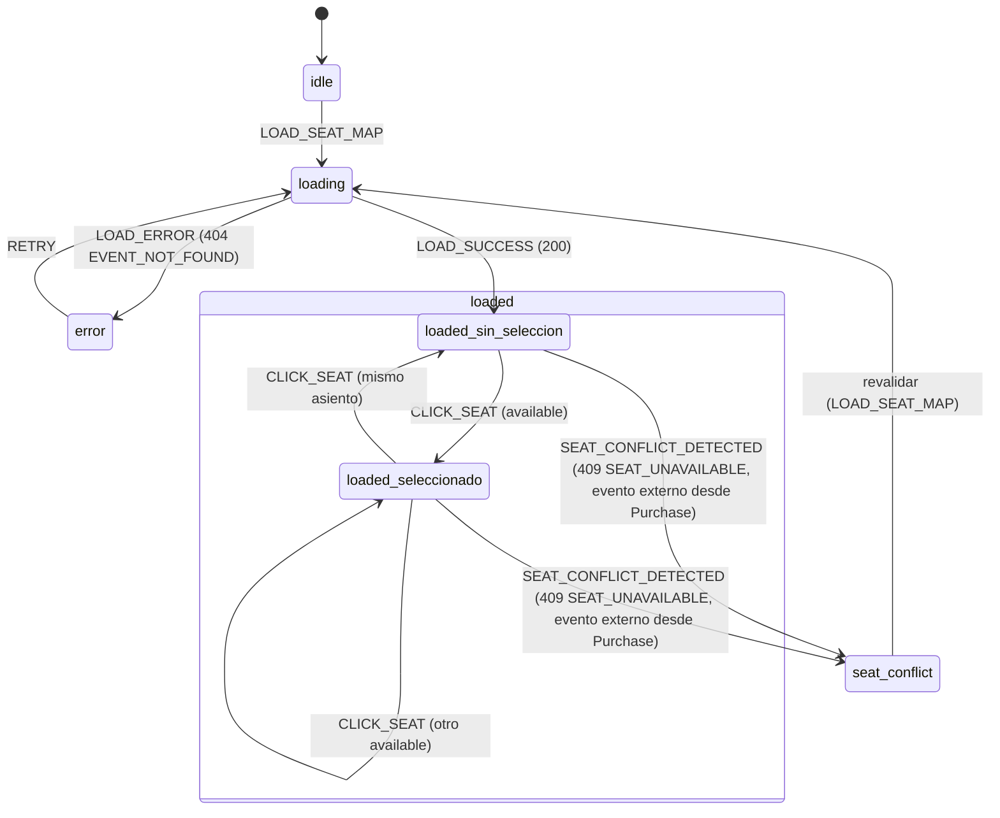

# SpecSeatMap.md — TicketFlow (React)

> Versión: 1.0.0
> Fuente de verdad: `Context.md` (v1.6.0, secciones 2.2, 5.4, 8.4, 11) y `docs/ticketflow-api.postman_collection.json`
> Alcance de este Spec: los 3 layouts de venue del Paso 3 (Select Your Seat), la FSM del asiento integrada a la slice `seatMap` (`Context.md` 8.4) — incluidas sus transiciones a error por `EVENT_NOT_FOUND` y `SEAT_UNAVAILABLE` — y los conceptos de Error Boundary y Polling aplicados a esta pantalla.
> Autosuficiente desde `Context.md` + Postman (principio de 3.2.1); consistente con `SpecState.md` sección 4 y `SpecPurchase.md` sección 2.2, sin depender de ellos para poder leerse.
> No redefine el HTTP Client ni sus interceptores (`SpecHttp.md`), ni el mecanismo de Revalidation general (`SpecState.md` 7.2) — los usa por nombre.

---

## 1. Los 3 layouts de venue (Context.md 5.4)

`GET /events/:id/seats` devuelve `venueType`, que determina cuál de los tres layouts se renderiza — **este campo no existe en `GET /events`** (confirmado repetidamente en `Context.md` 3.2.1 y 5.4 Step 1); sólo se conoce al llegar al Paso 3.

| `venueType` | Estructura | Dimensión | Posición del escenario | Tecnología de render confirmada por el PRD |
|---|---|---|---|---|
| `"arena"` | Asientos en círculos concéntricos alrededor de un escenario central | 4 anillos × 12 asientos = 48 asientos | Centro (label) | **SVG**, explícito en `Context.md` 5.4 ("Rendered with SVG") y en el objetivo pedagógico ("SVG rendering from scratch (arena layout)") |
| `"halfmoon"` | Filas con indentación progresiva, estilo teatro | 6 filas × 10 asientos = 60 asientos | Arriba, centrado | No especificada por el PRD — no se asume SVG por consistencia con arena; el PRD sólo nombra SVG para el layout arena |
| `"flat"` | Grilla rectangular simple | 8 filas × 10 asientos = 80 asientos | Arriba | No especificada por el PRD, misma nota que halfmoon |

Los tres se resuelven al mismo componente por convención de nombre (`SpecProject.md` 3.3: `SeatMap<VenueType>` → `SeatMapArena`, `SeatMapHalfmoon`, `SeatMapFlat`), elegido según el `venueType` recibido — este Spec no redefine esa convención, la aplica.

### 1.1 Nota sobre el render SVG del layout arena

`Context.md` no especifica la fórmula exacta de posicionamiento (ángulo/radio por asiento dentro de cada anillo) — sólo confirma la estructura (4 anillos concéntricos, 12 asientos por anillo, escenario central). Este Spec no inventa esa fórmula: la traducción concreta de `row`/`col` a coordenadas SVG es un detalle de implementación fuera del alcance "sin sintaxis de framework" de este documento. Lo que sí fija el Spec es la estructura conceptual: un lienzo SVG, un elemento central para el escenario, y un elemento por asiento distribuido según su anillo (`row`) y su posición dentro del anillo (`col`).

---

## 2. Estados visuales del asiento (Context.md 5.4)

| Estado | Color (token) | Interacción |
|---|---|---|
| `available` | `--color-aurora-green` | Clicable |
| `occupied` | `--color-bg-lighter` | Deshabilitado |
| `selected` | `--color-aurora-orange` | Clicable (deselecciona) |

`selected` no es un valor que devuelva el backend — `seat.status` del contrato sólo es `"available"` \| `"occupied"` (`SpecHttp.md` 7.6). `selected` es un estado puramente local, derivado de comparar `seat.seatId` con `selectedSeatId` de la slice (sección 4).

---

## 3. Leyenda de zonas y popover de asiento (Context.md 5.4)

- **Leyenda de zonas:** debajo del mapa — por cada entrada de `zones[]` (`SpecHttp.md` 7.6): nombre de zona, punto de color (`zone.color`), precio (`zone.price`). Es una proyección directa de `zones[]`, no requiere estado propio.
- **Popover de asiento:** al pasar el cursor o hacer clic sobre un asiento `available`, muestra fila (`seat.row`), columna (`seat.col`), zona (nombre, resuelto cruzando `seat.zone` con `zones[].id` — recordar que `seat.zone` es el **ID** de zona, no el nombre, `SpecHttp.md` 7.6) y precio (`zone.price`). No se muestra popover sobre asientos `occupied` (no son interactivos, sección 2).

---

## 4. FSM de la slice `seatMap` (Context.md 8.4)

### 4.1 Campos (sin cambios)

| Campo | Contenido |
|---|---|
| `zones` | `zones[]` de `GET /events/:id/seats` |
| `seats` | `seats[]` de `GET /events/:id/seats` |
| `selectedSeatId` | `string \| null` |

### 4.2 Dos capas de la FSM

Esta slice combina dos preocupaciones que este Spec integra en una sola máquina de estados, tal como pide el encargo:

1. **Carga de datos** (`idle` → `loading` → `loaded` → `error`) — gobernada por la respuesta de `GET /events/:id/seats`.
2. **Selección local** (`sin-seleccion` ⇄ `seleccionado`) — anidada dentro de `loaded`, igual que ya la definió `SpecState.md` 4.2, reconstruida aquí para que este documento sea autosuficiente.

### 4.3 Tabla de transiciones

| Estado | Acción | Guarda | Efecto |
|---|---|---|---|
| `idle` | `LOAD_SEAT_MAP` | Entrada al Paso 3 | → `loading`; dispara `GET /events/:id/seats` |
| `loading` | `LOAD_SUCCESS` | `200` | `zones`, `seats` = respuesta; `selectedSeatId = null` → `loaded` (`sin-seleccion`) |
| `loading` | `LOAD_ERROR` | `404 EVENT_NOT_FOUND` (`SpecHttp.md` 5.1) | → `error` (ver 4.4) |
| `loaded` (`sin-seleccion`) | `CLICK_SEAT` | seat clicado con `status: "available"` | `selectedSeatId = <seatId>` → `loaded` (`seleccionado`) |
| `loaded` (`seleccionado`) | `CLICK_SEAT` (mismo asiento) | — | `selectedSeatId = null` → `loaded` (`sin-seleccion`) |
| `loaded` (`seleccionado`) | `CLICK_SEAT` (otro asiento `available`) | — | `selectedSeatId = <nuevo seatId>` — permanece en `seleccionado` |
| `loaded` (cualquier subestado) | `SEAT_CONFLICT_DETECTED` | Evento externo: `409 SEAT_UNAVAILABLE` en `POST /bookings` durante el Paso 4 (`SpecPurchase.md` 2.2) — no ocurre en este endpoint, llega desde fuera de esta slice | → `seat-conflict` (ver 4.5) |
| `error` | `RETRY` | Acción manual del usuario (no exigida por el PRD, ver nota 4.4) | → `loading` |

Clicar un seat `occupied` **no dispara ninguna acción** — no es una transición, es un no-op por guarda fallida (5.4: no son clicables).

### 4.4 Rama de error — `EVENT_NOT_FOUND`

`404 EVENT_NOT_FOUND` (`SpecHttp.md` 5.1, Context.md 3.2.1) ocurre si el evento del que se piden asientos ya no existe — un caso de borde (por ejemplo, un enlace directo a un evento inválido), no el flujo normal, ya que el usuario llega al Paso 3 habiendo seleccionado el evento en el Paso 1 desde una lista válida. Este error bloquea todo el Paso 3 (no hay `zones`/`seats` que mostrar), a diferencia de `SEAT_UNAVAILABLE` (4.5), que sólo invalida la selección actual.

`Context.md` no especifica el texto ni la acción de recuperación exacta para este caso — este Spec no inventa una copia; sólo fija que la slice puede volver a `loading` vía `RETRY` si la feature decide ofrecer un botón de reintento, o que la navegación de vuelta al Paso 1 (fuera de esta slice, en la FSM de `purchase`) es la salida natural.

### 4.5 Rama de error — `SEAT_UNAVAILABLE`

Este código nunca lo devuelve `GET /events/:id/seats` — lo devuelve `POST /bookings` (`SpecHttp.md` 7.8), cuando el asiento elegido fue tomado por otra reserva entre la selección (Paso 3) y la creación de la reserva (Paso 4). `SpecPurchase.md` 2.2 ya definió que, ante este `409`, la Purchase FSM vuelve al Paso 3 pidiendo revalidar `seatMap`. Desde el punto de vista de esta slice, esa revalidación es la transición `SEAT_CONFLICT_DETECTED`:

1. La slice entra a `seat-conflict` — un estado transitorio, no una pantalla propia.
2. Se limpia `selectedSeatId` (el asiento elegido ya no es válido).
3. Se dispara automáticamente `LOAD_SEAT_MAP` de nuevo (mismo mecanismo de la sección 4.3, no un endpoint distinto) — esto es la aplicación concreta del principio general de Revalidation (`SpecState.md` 7.2): no se confía en la copia local, se vuelve a pedir la verdad al servidor.
4. Al recibir la respuesta, el asiento que causó el conflicto aparecerá como `occupied` (ya lo tomó otra reserva), y el usuario debe elegir uno distinto.

---

## 5. Diagrama Mermaid — FSM de `seatMap`

---

## 6. Error Boundary (concepto)

`EVENT_NOT_FOUND` (4.4) y `SEAT_UNAVAILABLE` (4.5) son errores de **datos** (respuestas HTTP con forma conocida) — se manejan con estados explícitos de la FSM, no con un Error Boundary. Un Error Boundary cubre un caso distinto: una **excepción de render** — por ejemplo, que el layout SVG de arena reciba un `seat.zone` que no exista en `zones[]` (una violación de la invariante del contrato que no debería ocurrir, pero que si ocurriera rompería el cálculo de color/posición del asiento y lanzaría una excepción durante el render, no durante el fetch).

Se menciona como concepto complementario, con este alcance: envolver el subárbol de render del layout de asientos (`SeatMapArena`/`SeatMapHalfmoon`/`SeatMapFlat`) en un límite que capture una excepción de ese tipo y muestre una UI de repliegue, en vez de que el error se propague y rompa el resto del árbol de la aplicación (el stepper, el sidebar, etc.). Es una capa defensiva de último recurso — no reemplaza ni se superpone a la FSM de las secciones 4.4/4.5, que ya cubren los errores de datos esperados por el contrato.

---

## 7. Polling (concepto considerado, explícitamente fuera de alcance)

`Context.md` 11 excluye explícitamente del alcance del curso el **"Real-time seat locking (race conditions)"**. Polling — repetir `GET /events/:id/seats` periódicamente mientras el usuario está en el Paso 3 o 4, para detectar que un asiento fue tomado por otra persona antes de que el propio usuario intente pagar — sería una forma de mitigar (no eliminar) esa misma clase de condición de carrera.

Se menciona aquí como concepto explícitamente **no implementado** en este proyecto, precisamente por la exclusión de la sección 11: este Spec no agrega un mecanismo de sondeo periódico a la slice `seatMap`. La única defensa real contra un asiento tomado en paralelo es la validación del servidor en el momento de crear la reserva (`409 SEAT_UNAVAILABLE`) más la Revalidation ya descrita en la sección 4.5 — una defensa "al final del flujo", no preventiva. Si el proyecto decidiera adoptar Polling más adelante, sería un cambio de alcance que tendría que reflejarse primero en `Context.md`, no introducirse aquí por iniciativa de este Spec.

---

## 8. Fuera de alcance de este Spec

- La fórmula exacta de posicionamiento SVG por asiento (sección 1.1) — detalle de implementación.
- El texto y la acción de recuperación exacta ante `EVENT_NOT_FOUND` (sección 4.4) — pendiente de confirmación, no inventado.
- El resto de la FSM de `purchase` (Pasos 1, 2, 4, 5) — corresponde a `SpecPurchase.md`.
- La tabla, filtros y paginación de `/bookings` — corresponde a `SpecBookings.md`.
