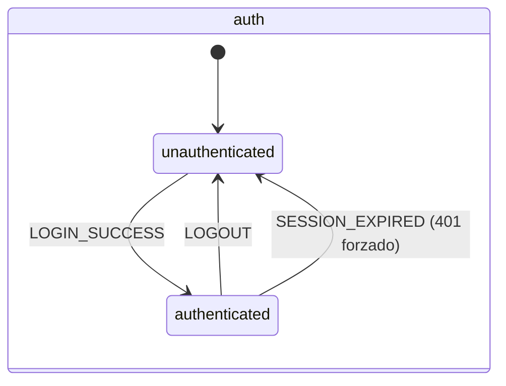
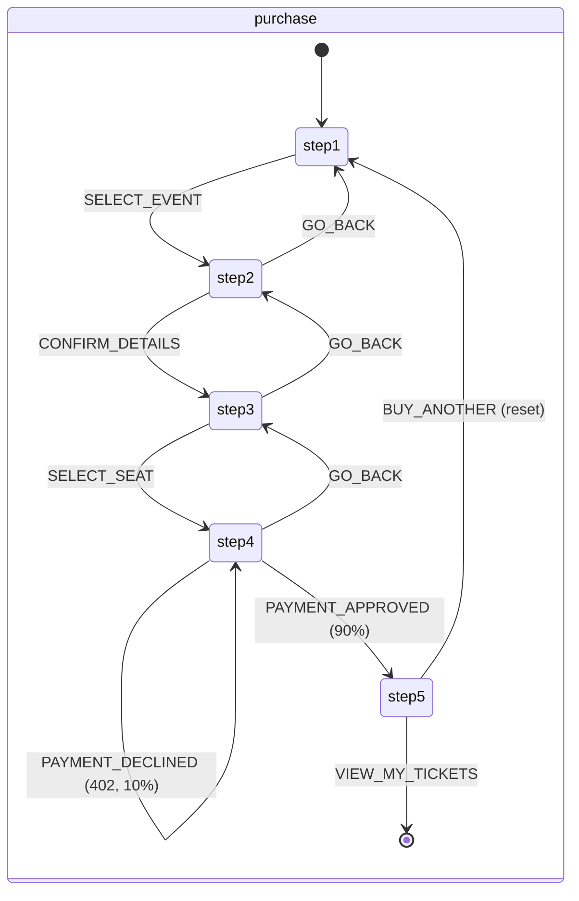
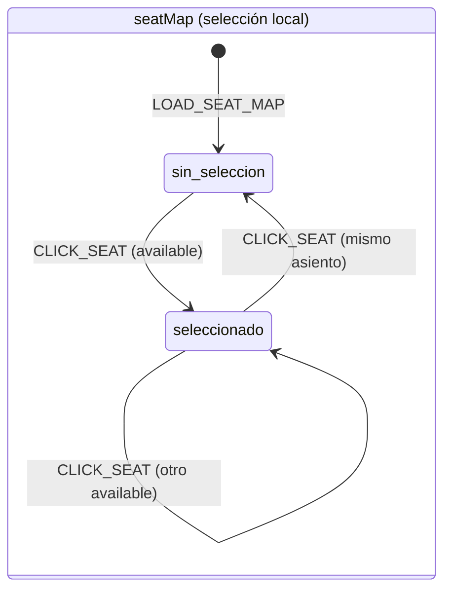
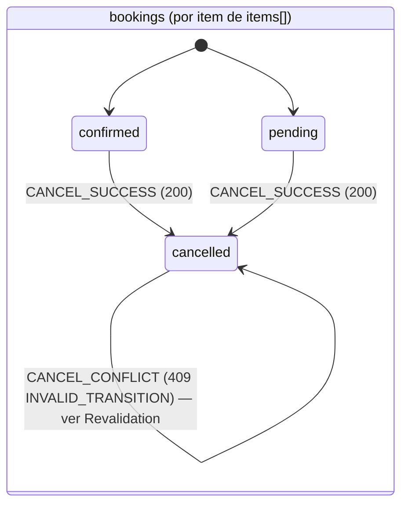
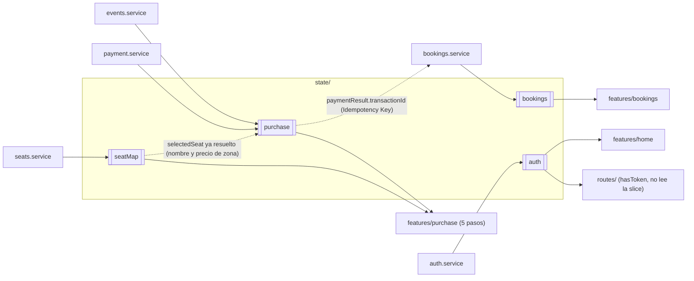

# SpecState.md — TicketFlow (React)

> Versión: 1.0.0
> Fuente de verdad: `Context.md` (v1.6.0, secciones 5.4, 5.5, 6.1, 6.2, 6.3, 8.4) y `docs/ticketflow-api.postman_collection.json`
> Alcance de este Spec: traducir las **4 slices de referencia** (`Context.md` 8.4) a máquinas de estados finitas (FSM) concretas para este proyecto, y definir la estrategia de **Revalidation** cuando el servidor contradice el estado local (caso confirmado: `INVALID_TRANSITION`).
> Este Spec no crea slices nuevas, no renombra las cuatro existentes y no cambia sus campos — traduce lo que `Context.md` 8.4 ya cerró: *"Estas cuatro slices, con estos nombres y estos campos, son la referencia. Ningún Spec que maneje estado inventa su propia estructura ni renombra una slice."*
> Tampoco redefine el HTTP Client ni Token Storage (`SpecHttp.md`) ni el flujo de login/logout (`SpecAuth.md`) — los usa por nombre, igual que exige la regla de dependencia unidireccional ya aplicada en esos dos documentos.

---

## 1. Convención de estado (recordatorio, no redefinición)

`SpecProject.md` (secciones 0 y 3.6) ya fijó que la gestión de estado usa **Context API + `useReducer`**, un módulo por slice (`<slice>.context` + `<slice>.reducer`), y que cada slice conserva el identificador exacto de `Context.md` 8.4 (`auth`, `purchase`, `seatMap`, `bookings`) aunque su carpeta use `kebab-case`. Este Spec no reabre esa decisión — la usa como vehículo para expresar las FSM que siguen.

**Modelo de cada FSM en este documento:** estado discreto → acción/evento que dispara la transición → guarda (condición que debe cumplirse) → efecto (qué campos de la slice cambian). Ninguna transición implícita: si una pantalla necesita cambiar el estado de una slice fuera de las acciones listadas aquí, ese cambio no está soportado por este Spec y debe señalarse como pendiente, no improvisarse.

---

## 2. Slice `auth`

### 2.1 Campos (Context.md 8.4 — sin cambios)
| Campo | Contenido |
|---|---|
| `user` | Igual forma que `LoginResponseSchema.user` (`SpecAuth.md` 5) / respuesta de `GET /users/me` (`SpecHttp.md` 7.4): `id`, `name`, `lastname`, `email`, `phone` |
| `isAuthenticated` | boolean |

### 2.2 FSM

| Estado | Acción | Guarda | Efecto |
|---|---|---|---|
| `unauthenticated` | `LOGIN_SUCCESS` | Respuesta `200` de `POST /auth/login` ya validada (`SpecAuth.md` 2.3) | `user = <payload.user>`, `isAuthenticated = true` |
| `authenticated` | `LOGOUT` | Respuesta `200` de `POST /auth/logout` (`SpecAuth.md` 3.2) | `user = null`, `isAuthenticated = false` |
| `authenticated` | `SESSION_EXPIRED` | `401` en cualquier endpoint protegido, forzado por el interceptor global (`SpecHttp.md` 4.2) — **no** aplica a `POST /auth/login` (excepción cerrada) | `user = null`, `isAuthenticated = false` |

Esta FSM es exactamente la de `Context.md` 6.1 (`[unauthenticated] ↔ [authenticated]`); `SESSION_EXPIRED` es la misma transición que `LOGOUT` vista desde el origen (un `401` forzado), no un tercer estado nuevo.

**Nota de sincronización (ya resuelta en `SpecAuth.md` 4):** `SESSION_EXPIRED` puede dispararse fuera del árbol de React (dentro de `http/`), que no puede escribir en esta slice sin violar la dirección de dependencia. Las guardas de ruta no dependen de que esta slice esté al día — usan `hasToken()` directamente (`Context.md` 8.5). Este Spec no cambia esa decisión.

---

## 3. Slice `purchase`

### 3.1 Campos (Context.md 8.4 — sin cambios)
| Campo | Contenido |
|---|---|
| `selectedEvent` | Forma del item de `GET /events` (`SpecHttp.md` 7.5) — **nunca incluye `venueType`**, confirmado ausente en ese endpoint |
| `contactDetails` | Copia editable de `{ name, lastname, email, phone }`, pre-poblada desde `GET /users/me` (`SpecHttp.md` 7.4) pero desacoplada del perfil — editarla no modifica el perfil real |
| `selectedSeat` | Ver nota de resolución de zona en 3.3 |
| `paymentResult` | Forma de la respuesta `200` de `POST /payment/process` (`SpecHttp.md` 7.7): `transactionId`, `status`, `message`, `processedAt` |

### 3.2 FSM (Context.md 6.2)

| Estado | Acción | Guarda | Efecto |
|---|---|---|---|
| `step-1-select-event` | `SELECT_EVENT` | Un evento de `GET /events` está resaltado (botón Next habilitado sólo con selección, 5.4 Step 1) | `selectedEvent = <event>` → avanza a `step-2-your-details` |
| `step-2-your-details` | `GO_BACK` | — | vuelve a `step-1-select-event` (`selectedEvent` se conserva) |
| `step-2-your-details` | `CONFIRM_DETAILS` | Todos los campos del formulario completos (5.4 Step 2: todos requeridos) | `contactDetails = <form>` → avanza a `step-3-select-seat` |
| `step-3-select-seat` | `GO_BACK` | — | vuelve a `step-2-your-details` (`contactDetails` se conserva) |
| `step-3-select-seat` | `SELECT_SEAT` | Un seat con `status: "available"` fue seleccionado en la slice `seatMap` (sección 4) | `selectedSeat = <seat resuelto, ver 3.3>` → avanza a `step-4-payment` |
| `step-4-payment` | `GO_BACK` | — | vuelve a `step-3-select-seat` (`selectedSeat` se conserva) |
| `step-4-payment` | `PAYMENT_APPROVED` | `200` de `POST /payment/process` (90% de los casos) seguido de `201` de `POST /bookings` | `paymentResult = <payment response>` → avanza a `step-5-confirmation` |
| `step-4-payment` | `PAYMENT_DECLINED` | `402 PAYMENT_DECLINED` de `POST /payment/process` (10% de los casos, `SpecHttp.md` 5.1) | Permanece en `step-4-payment`; error local, botón de pago se reactiva (5.4 Step 4) — no hay retroceso de estado, es un self-loop |
| `step-5-confirmation` | `BUY_ANOTHER` | — | reinicia a `step-1-select-event` con `selectedEvent = null`, `selectedSeat = null`, `paymentResult = null` (ver nota 3.4) |
| `step-5-confirmation` | `VIEW_MY_TICKETS` | — | sale del stepper de compra, navega a `/bookings`; no es una transición dentro de esta FSM |

**Regla explícita de 6.2, conservada sin cambios:** no existe transición de retroceso desde `step-5-confirmation` hacia `step-4-payment` ni ningún paso anterior — sólo `BUY_ANOTHER` (reinicio) o salir del flujo.

### 3.3 Resolución de zona al fijar `selectedSeat`

`GET /events/:id/seats` (`SpecHttp.md` 7.6) devuelve `seat.zone` como **ID de zona**, no como nombre — y el resumen de Step 4 (5.4) necesita mostrar el nombre de la zona y su precio. Como `selectedSeat` debe seguir siendo útil en Step 4 aunque la slice `seatMap` ya no esté montada (el usuario pudo volver atrás y volver a avanzar), la transición `SELECT_SEAT` debe **resolver la zona contra `zones[]` en el momento de la selección** y guardar en `selectedSeat` tanto el `seatId`/`row`/`col` como el nombre y precio de zona ya resueltos — no sólo el ID crudo. Esta es una consecuencia directa de mantener la FSM autoconsistente (un estado no puede depender de datos que ya no existen en otra slice), no una regla de negocio nueva.

### 3.4 Alcance del reinicio en `BUY_ANOTHER`

`Context.md` 5.4 Step 5 sólo dice *"reset stepper to Step 1"*, sin detallar campo por campo. Por consistencia de la propia FSM (un estado `step-1-select-event` no puede coexistir con un `selectedSeat` o `paymentResult` de la compra anterior, o el Paso 4 mostraría datos de una compra ya confirmada), este Spec fija que el reinicio limpia `selectedEvent`, `selectedSeat` y `paymentResult`. `contactDetails` no necesita limpiarse explícitamente porque el Paso 2 siempre lo vuelve a poblar al entrar (5.4 Step 2: pre-fill on mount) — mantenerlo o no es indistinto para el usuario y se deja como detalle de implementación de la feature, no de esta FSM.

---

## 4. Slice `seatMap`

### 4.1 Campos (Context.md 8.4 — sin cambios)
| Campo | Contenido |
|---|---|
| `zones` | Igual forma que `GET /events/:id/seats` → `zones[]` (`SpecHttp.md` 7.6): `id`, `name`, `color`, `price` |
| `seats` | Igual forma que `GET /events/:id/seats` → `seats[]`: `seatId`, `row`, `col`, `zone` (ID), `status` |
| `selectedSeatId` | `string \| null` |

### 4.2 FSM — selección local de asiento

A diferencia de `auth`, `purchase` y `bookings`, esta slice no tiene una FSM de negocio propia en `Context.md` — sólo la tabla de estados de un seat (5.4: Available / Occupied / Selected). La FSM aquí es puramente de **selección local**, sobre `selectedSeatId`:

| Estado | Acción | Guarda | Efecto |
|---|---|---|---|
| `sin-seleccion` | `LOAD_SEAT_MAP` | Entrada al Paso 3 (`GET /events/:id/seats`) | `zones`, `seats` = respuesta; `selectedSeatId = null` — **esta acción siempre revalida la slice completa desde cero**, ver sección 7.3 |
| `sin-seleccion` | `CLICK_SEAT` | El seat clicado tiene `status: "available"` (5.4: seats `occupied` no son clicables) | `selectedSeatId = <seatId>` → pasa a `un-asiento-seleccionado` |
| `un-asiento-seleccionado` | `CLICK_SEAT` (mismo asiento) | — | `selectedSeatId = null` → vuelve a `sin-seleccion` (deselección, 5.4: "Selected — Clickable (deselects)") |
| `un-asiento-seleccionado` | `CLICK_SEAT` (otro asiento `available`) | El nuevo seat tiene `status: "available"` | `selectedSeatId = <nuevo seatId>` — permanece en `un-asiento-seleccionado`, sólo cambia el id (selección única, 5.4: "select one seat") |

`zones` y `seats` no tienen transición propia fuera de `LOAD_SEAT_MAP` — esta slice no soporta actualizar un seat individual a `occupied` de forma optimista; siempre se revalida completa (ver 7.3).

---

## 5. Slice `bookings`

### 5.1 Campos (Context.md 8.4 — sin cambios)
| Campo | Contenido |
|---|---|
| `filters` | `{ eventName?, status?, dateFrom?, dateTo? }` — mismos parámetros que `GET /bookings` (`SpecHttp.md` 7.9) |
| `page` | number, por defecto `1` |
| `limit` | number, por defecto `10` (máximo `50`, límite del servidor) |
| `items` | Array con la forma de `GET /bookings` → `data[]` (`SpecHttp.md` 7.9) |

**Distinción importante dentro de la misma slice:** `filters`/`page`/`limit` son **estado de consulta** (qué se le pide al servidor) — no tienen FSM, cambian libremente y disparan un nuevo `LOAD_BOOKINGS`. `items` sí contiene una FSM real, pero **por elemento**: cada booking dentro de `items` tiene su propio estado de `status`, independiente de los demás.

### 5.2 FSM por booking (Context.md 6.3)

| Estado | Acción | Guarda | Efecto |
|---|---|---|---|
| — | `LOAD_BOOKINGS` | Cambio de `filters`, `page` o `limit`, o entrada a `/bookings` | `items` = `data[]` de la respuesta — **revalida por completo el listado**, sustituyendo cualquier patch local previo |
| `confirmed` | `CANCEL_SUCCESS` | `200` de `PATCH /bookings/:id/cancel` (5.5: botón sólo visible/habilitado si `confirmed` o `pending`) | Patch local del item: `status = "cancelled"`, `cancelledAt = <respuesta>` (sin refetch completo — esto es la "optimistic update" que exige 5.5) |
| `pending` | `CANCEL_SUCCESS` | Igual que arriba | Igual que arriba |
| `cancelled` | — | — | **Estado terminal.** No existe ninguna acción que saque a un booking de `cancelled` (`Context.md` 6.3: `[cancelled] → ✗`) |
| `confirmed` / `pending` | `CANCEL_CONFLICT` | `409 INVALID_TRANSITION` al intentar cancelar (ver sección 7) | No se aplica el patch optimista — dispara Revalidation (sección 7) |

Esta tabla traduce exactamente `Context.md` 6.3: `confirmed → cancelled` y `pending → cancelled` son transiciones válidas y terminales; `cancelled → cancelled` no es una transición real, es el caso de error que motiva la sección 7.

---

## 6. Diagrama Mermaid — FSM por slice

---

## 7. Revalidation tras `INVALID_TRANSITION`

### 7.1 Por qué puede ocurrir

El botón **Cancelar** sólo se muestra/habilita si la slice `bookings` cree que el item está en `confirmed` o `pending` (5.5) — esa guarda ya filtra la mayoría de los intentos inválidos. Pero la slice es una **copia local** tomada en el último `LOAD_BOOKINGS`; puede quedar desactualizada si, entre ese fetch y el clic en Cancelar, el mismo booking fue cancelado por otra vía (otra pestaña, otra sesión del mismo usuario, o un cancel anterior cuyo resultado no llegó a reflejarse). Cuando eso pasa, `PATCH /bookings/:id/cancel` responde `409 INVALID_TRANSITION` (`SpecHttp.md` 5.1) — el servidor, no la slice, tiene la verdad.

### 7.2 Principio general de Revalidation

Cuando una acción que asume una transición de FSM es rechazada por el servidor con un `409` de negocio, **la slice no debe conservar su copia local** de ese recurso — hacerlo dejaría la guarda de UI mintiendo (mostraría de nuevo un botón de acción que va a volver a fallar). La respuesta correcta es:

1. **No aplicar** el patch optimista que se habría aplicado en caso de éxito.
2. **Revalidar** el recurso afectado contra el servidor (no asumir cuál es su estado real — pedirlo).
3. **Sustituir** la copia local por la verdad revalidada, para que la guarda de UI vuelva a ser correcta en el siguiente render.
4. Mostrar al usuario que la acción no se realizó (el texto exacto no está fijado por `Context.md` — queda pendiente para la feature que lo implemente; este Spec no inventa una copia).

### 7.3 Aplicación concreta — `bookings` ante `INVALID_TRANSITION`

| Paso | Acción |
|---|---|
| 1 | `PATCH /bookings/:id/cancel` responde `409 INVALID_TRANSITION` |
| 2 | La slice **no** ejecuta `CANCEL_SUCCESS` (ninguna transición de estado local ocurre) |
| 3 | Se dispara `CANCEL_CONFLICT`, cuyo efecto es re-consultar el estado real de ese booking — usando `GET /bookings` con los mismos `filters`/`page`/`limit` ya activos en la slice (mismo mecanismo que `LOAD_BOOKINGS`, sección 5.2), no un endpoint nuevo |
| 4 | El item revalidado (ya `cancelled` en el servidor) reemplaza al item local desactualizado en `items` |
| 5 | La guarda de UI (botón Cancelar visible sólo si `confirmed`/`pending`) queda correcta de inmediato: el item ahora es `cancelled`, así que el botón desaparece sin que el usuario pueda reintentar la misma acción inválida |

### 7.4 Aplicación análoga (fuera de alcance de este Spec, sólo referencia)

El mismo principio de Revalidation aplicaría a `SEAT_UNAVAILABLE` (`409`, `SpecHttp.md` 5.1) sobre la slice `seatMap`/`purchase` cuando el asiento elegido en el Paso 3 fue tomado por otra reserva antes de completar el pago en el Paso 4: no se debería asumir que el asiento sigue disponible, sino revalidar (`LOAD_SEAT_MAP`) antes de permitir un nuevo intento. La definición completa de ese caso corresponde a `SpecPurchase.md`/`SpecSeatMap.md`, no a este documento — se señala aquí sólo para que ese Spec no reinvente el principio de Revalidation ya fijado en 7.2.

---

## 8. Diagrama Mermaid — relación entre slices, servicios y features

---

## 9. Fuera de alcance de este Spec

- El texto exacto del mensaje de error mostrado tras `CANCEL_CONFLICT` — no está fijado por `Context.md`, corresponde a `SpecBookings.md`.
- La definición completa del caso `SEAT_UNAVAILABLE` sobre `seatMap`/`purchase` (sección 7.4) — corresponde a `SpecPurchase.md`/`SpecSeatMap.md`.
- Los componentes de UI que leen cada slice (tarjetas, tabla, stepper) — corresponden a los Specs de feature, no a este documento de estado.
